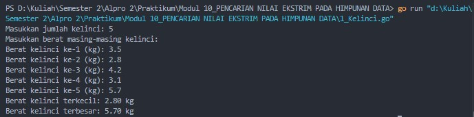
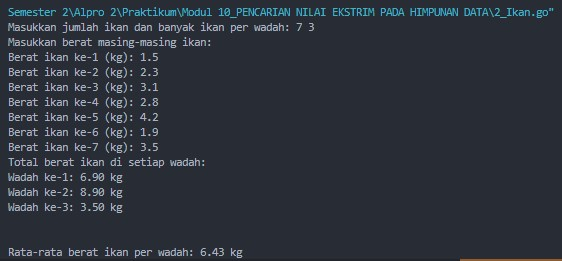
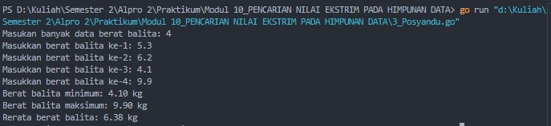

# <h1 align="center">Laporan Praktikum Modul 10 <br> PENCARIAN NILAI EKSTRIM PADA HIMPUNAN DATA</h1>
<p align="center">Cholid Afiddrus Wijayanto - 103112430012</p>

## Dasar Teori

Pencarian nilai ekstrim adalah proses menemukan nilai terbesar (maksimum) atau terkecil (minimum) dalam sekumpulan data. Algoritma dasarnya bekerja dengan menetapkan elemen pertama sebagai nilai ekstrim sementara, lalu membandingkan dengan setiap elemen berikutnya dan memperbarui nilai ekstrim jika ditemukan nilai yang lebih ekstrim. Hasil pencarian ini bisa berupa nilai ekstrim itu sendiri atau indeks posisinya dalam data, tergantung kebutuhan program.

## Unguided

### Soal 1

Sebuah program digunakan untuk mendata berat anak kelinci yang akan dijual ke pasar. Program ini menggunakan array dengan kapasitas 1000 untuk menampung data berat anak kelinci yang akan dijual. Masukan terdiri dari sekumpulan bilangan, yang mana bilangan pertama adalah bilangan bulat N yang menyatakan banyaknya anak kelinci yang akan ditimbang beratnya. Selanjutnya N bilangan riil berikutnya adalah berat dari anak kelinci yang akan dijual. Keluaran terdiri dari dua buah bilangan riil yang menyatakan berat kelinci terkecil dan terbesar.

```go
package main

import "fmt"
  
func main() {
    var beratKelinci [1000]float64
    var N int

    fmt.Print("Masukkan jumlah kelinci: ")
    fmt.Scan(&N)

    fmt.Println("Masukkan berat masing-masing kelinci:")
    for i := 0; i < N; i++ {
        fmt.Printf("Berat kelinci ke-%d (kg): ", i+1)
        fmt.Scan(&beratKelinci[i])
    }

    min := beratKelinci[0]
    max := beratKelinci[0]

    for i := 1; i < N; i++ {
        if beratKelinci[i] < min {
            min = beratKelinci[i]
        }
        if beratKelinci[i] > max {
            max = beratKelinci[i]
        }
    }

    fmt.Printf("Berat kelinci terkecil: %.2f kg\n", min)
    fmt.Printf("Berat kelinci terbesar: %.2f kg\n", max)
}
```

**Output:**




Program di atas merupakan program yang digunakan untuk mencari nilai ekstrim (minimum dan maksimum) dari data berat anak kelinci yang akan dijual ke pasar. User diminta memasukkan jumlah kelinci yang akan didata, kemudian dilanjutkan dengan memasukkan berat masing-masing kelinci. Program menggunakan array dengan kapasitas 1000 untuk menyimpan data berat kelinci, namun hanya mengisi sejumlah N elemen sesuai input user. Pencarian nilai ekstrim dilakukan dengan membandingkan setiap nilai dalam array menggunakan algoritma pencarian sekuensial, di mana nilai minimum dan maksimum awalnya diinisialisasi dengan elemen pertama array. Program kemudian melakukan iterasi dari elemen kedua hingga elemen ke-N, membandingkan setiap nilai dengan nilai minimum dan maksimum yang sudah disimpan. Jika ditemukan nilai yang lebih kecil dari minimum atau lebih besar dari maksimum, nilai tersebut akan diperbarui. Kesimpulannya, program ini mengimplementasikan konsep pencarian nilai ekstrim pada tipe data dasar dengan menggunakan perulangan dan variabel penyimpan sementara untuk menemukan berat kelinci terkecil dan terbesar.
### Soal 2

Sebuah program digunakan untuk menentukan tarif ikan yang akan dijual ke pasar. Program ini menggunakan array dengan kapasitas 1000 untuk menampung data berat ikan yang akan dijual. Masukan terdiri dari dua baris, yang mana baris pertama terdiri dari dua bilangan bulat x dan y. Bilangan x menyatakan banyaknya ikan yang akan dijual, sedangkan y adalah banyaknya ikan yang akan dimasukan ke dalam wadah. Baris kedua terdiri dari sejumlah x bilangan riil yang menyatakan banyaknya ikan yang akan dijual. Keluaran terdiri dari dua baris. Baris pertama adalah kumpulan bilangan riil yang menyatakan total berat ikan di setiap wadah (jumlah wadah tergantung pada nilai x dan y, urutan ikan yang dimasukan ke dalam wadah sesuai urutan pada masukan baris ke-2). Baris kedua adalah sebuah bilangan riil yang menyatakan berat rata-rata ikan di setiap wadah.

```go
package main

import "fmt"
  
func main() {
    var beratIkan [1000]float64
    var x, y int
  
    fmt.Print("Masukkan jumlah ikan dan banyak ikan per wadah: ")
    fmt.Scan(&x, &y)
  
    fmt.Println("Masukkan berat masing-masing ikan:")
    for i := 0; i < x; i++ {
        fmt.Printf("Berat ikan ke-%d (kg): ", i+1)
        fmt.Scan(&beratIkan[i])
    }

    jumlahWadah := (x + y - 1) / y

    var beratPerWadah [1000]float64

    for i := 0; i < x; i++ {
        wadahKe := i / y
        beratPerWadah[wadahKe] += beratIkan[i]
    }

    fmt.Printf("Total berat ikan di setiap wadah:\n")
    for i := 0; i < jumlahWadah; i++ {
        fmt.Printf("Wadah ke-%d: %.2f kg\n", i+1, beratPerWadah[i])
    }
    
    fmt.Println()

    var totalBerat float64
    
    for i := 0; i < jumlahWadah; i++ {
        totalBerat += beratPerWadah[i]
    }

    rataRata := totalBerat / float64(jumlahWadah)
    fmt.Printf("\nRata-rata berat ikan per wadah: %.2f kg\n", rataRata)
}
```

**Output:**



Program di atas merupakan program yang digunakan untuk mendistribusikan ikan ke dalam wadah dan menghitung total berat serta rata-rata berat ikan di setiap wadah. User diminta memasukkan dua nilai yaitu jumlah ikan (x) dan banyak ikan per wadah (y), diikuti dengan berat masing-masing ikan. Program menggunakan array untuk menyimpan data berat ikan dan array lain untuk menyimpan total berat per wadah. Penghitungan jumlah wadah yang diperlukan menggunakan rumus pembulatan ke atas dari x/y, kemudian program mendistribusikan ikan ke dalam wadah-wadah tersebut berdasarkan urutan input. Algoritma penempatan menggunakan pembagian integer (i/y) untuk menentukan wadah ke berapa suatu ikan ditempatkan. Setelah semua ikan didistribusikan, program menghitung total berat per wadah dan rata-rata berat dari seluruh wadah. Kesimpulannya, program ini mengimplementasikan konsep array dan pemrosesan sekuensial untuk mengelola distribusi ikan ke dalam wadah, kemudian melakukan pencarian nilai rata-rata yang merupakan salah satu operasi statistik dasar pada kumpulan data.

### Soal 3

Pos Pelayanan Terpadu (posyandu) sebagai tempat pelayanan kesehatan perlu mencatat data berat balita (dalam kg). Petugas akan memasukkan data tersebut ke dalam array. Dari data yang diperoleh akan dicari berat balita terkecil, terbesar, dan reratanya.

```go
package main

import "fmt"

type arrBalita [100]float64

func hitungMinMax(arrBerat arrBalita, n int, bMin, bMax *float64) {
    *bMin = arrBerat[0]
    *bMax = arrBerat[0]

    for i := 1; i < n; i++ {
        if arrBerat[i] < *bMin {
            *bMin = arrBerat[i]
        }
        if arrBerat[i] > *bMax {
            *bMax = arrBerat[i]
        }
    }
}

func rerata(arrBerat arrBalita, n int) float64 {
    var total float64
    
    for i := 0; i < n; i++ {
        total += arrBerat[i]
    }
    return total / float64(n)
}

func main() {
    var beratBalita arrBalita
    var jumlahBalita int
    var min, max, avg float64

    fmt.Print("Masukan banyak data berat balita: ")
    fmt.Scan(&jumlahBalita)

    for i := 0; i < jumlahBalita; i++ {
        fmt.Printf("Masukkan berat balita ke-%d: ", i+1)
        fmt.Scan(&beratBalita[i])
    }

    hitungMinMax(beratBalita, jumlahBalita, &min, &max)
    avg = rerata(beratBalita, jumlahBalita)

    fmt.Printf("Berat balita minimum: %.2f kg\n", min)
    fmt.Printf("Berat balita maksimum: %.2f kg\n", max)
    fmt.Printf("Rerata berat balita: %.2f kg\n", avg)
}
```

**Output:**



Program di atas merupakan program yang digunakan untuk mencatat dan menganalisis data berat balita di Pos Pelayanan Terpadu (Posyandu). User diminta memasukkan jumlah balita yang akan didata, diikuti dengan berat masing-masing balita. Program ini mengimplementasikan tipe data terstruktur khusus berupa arrBalita yang merupakan array dengan kapasitas 100 elemen bertipe float64. Program menggunakan dua fungsi utama, yaitu hitungMinMax untuk mencari berat minimum dan maksimum balita menggunakan pointer sebagai parameter keluaran, dan fungsi rerata untuk menghitung rata-rata berat dari seluruh balita. Fungsi hitungMinMax menerapkan algoritma pencarian nilai ekstrim yang mirip dengan soal pertama, namun dengan penggunaan pointer untuk menyimpan hasil pencarian. Sementara itu, fungsi rerata mengakumulasikan seluruh nilai berat dan membaginya dengan jumlah balita. Kesimpulannya, program ini mendemonstrasikan penggunaan array, tipe data terstruktur, fungsi dengan parameter pointer, dan implementasi algoritma pencarian nilai ekstrim untuk analisis statistik sederhana pada data berat balita.