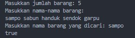
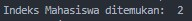
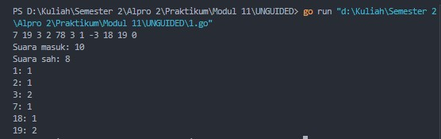
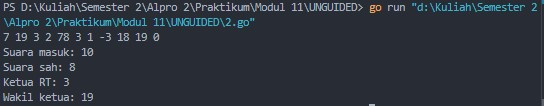
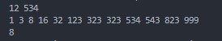

# <h1 align="center">Laporan Praktikum Modul 11 <br> PENCARIAN NILAI EKSTRIM PADA HIMPUNAN DATA</h1>
<p align="center">Cholid Afiddrus Wijayanto - 103112430012</p>

## Dasar Teori

Pencarian nilai acak pada himpunan data merupakan proses menemukan suatu nilai spesifik dalam sekumpulan data. Terdapat dua algoritma utama untuk proses pencarian yaitu Sequential Search dan Binary Search. Sequential Search bekerja dengan memeriksa data satu per satu secara berurutan hingga ditemukan atau mencapai akhir data, cocok untuk data tidak terurut. Binary Search bekerja dengan membagi rentang pencarian menjadi dua bagian pada setiap iterasi dengan syarat data harus terurut terlebih dahulu, memiliki efisiensi yang jauh lebih baik dibanding Sequential Search untuk data berjumlah besar.

## Guided
### Soal 1

```go
package main

import "fmt"
  
func cariBarang(daftar []string, x string) bool {
    for _, barang := range daftar {
        if barang == x {
            return true
        }
    }
    return false
} 

func main() {
    var n int

    fmt.Print("Masukkan jumlah barang: ")
    fmt.Scan(&n)
  
    daftarBarang := make([]string, n)

    fmt.Println("Masukkan nama-nama barang:")

    for i := 0; i < n; i++ {
        fmt.Scan(&daftarBarang[i])
    }
    
    var barangDicari string
    fmt.Print("Masukkan nama barang yang dicari: ")
    fmt.Scan(&barangDicari)

    ditemukan := cariBarang(daftarBarang, barangDicari)

    fmt.Println(ditemukan)
}
```

**Output:**




Program di atas merupakan program yang digunakan untuk menghitung suara pemilihan ketua RT. User diminta memasukkan bilangan bulat yang merepresentasikan nomor calon ketua RT yang dipilih, lalu program menggunakan perulangan untuk membaca input hingga ditemukan angka 0 sebagai penanda akhir. Setiap suara masuk akan dihitung dalam variabel suara, dan jika suara valid (bernilai 1-20), maka dihitung sebagai suara sah dan disimpan dalam array voteCount. Program kemudian menampilkan total suara masuk, jumlah suara sah, dan perolehan suara untuk masing-masing kandidat yang mendapat suara. Kesimpulannya, program ini digunakan untuk melakukan validasi dan penghitungan suara pemilihan dengan memanfaatkan struktur data array sebagai pencatat frekuensi kemunculan nomor kandidat.

### Soal 2

```go
package main

import "fmt"

func seqSearch(kalimat string, karakter byte) []int {
    var posisi []int
    
    for i := 0; i < len(kalimat); i++ {
        if kalimat[i] == karakter {
            posisi = append(posisi, i)
        }
    }
    return posisi
}

func main() {
    var kalimat string
    var karakter rune
  
    kalimat = "algoritma pemrograman"
    karakter = 'a'
    posisi := seqSearch(kalimat, byte(karakter))

    if len(posisi) > 0 {
        fmt.Print("Karakter ditemukan pada indeks: ")
        for i := 0; i < len(posisi); i++ {
            fmt.Print(posisi[i])
            if i != len(posisi)-1 {
                fmt.Print(", ")
            }
        }
    } else {
        fmt.Println("Karakter tidak ditemukan.")
    }
}
```

**Output:**


Program di atas merupakan program yang digunakan untuk mencari semua posisi kemunculan suatu karakter dalam sebuah kalimat. Program menginisialisasi sebuah kalimat "algoritma pemrograman" dan karakter yang dicari yaitu 'a'. Program menggunakan fungsi `seqSearch` yang mengimplementasikan algoritma sequential search untuk memeriksa setiap karakter dalam kalimat. Ketika fungsi menemukan karakter yang cocok dengan yang dicari, posisi (indeks) karakter tersebut ditambahkan ke dalam slice `posisi` menggunakan metode `append`. Setelah seluruh kalimat diperiksa, fungsi mengembalikan slice yang berisi semua posisi karakter yang ditemukan. Program kemudian menampilkan indeks-indeks tersebut dengan format yang rapi, atau menampilkan pesan jika karakter tidak ditemukan. Kesimpulannya, program ini digunakan untuk melacak semua kemunculan suatu karakter dalam teks dengan memanfaatkan algoritma sequential search dan struktur data dinamis slice untuk menyimpan hasil pencarian.

### Soal 3

```go
package main

import "fmt"

type Mahasiswa struct {
    NIM  string
    Nama string
}
  
func binarySearch(mahasiswa []Mahasiswa, target string) int {
    left := 0
    right := len(mahasiswa) - 1

    for left <= right {
        mid := left + (right-left)/2
        
        if mahasiswa[mid].NIM == target {
            return mid
        }

        if mahasiswa[mid].NIM > target {
            right = mid - 1
        } else {
            left = mid + 1
        }
    }
    return -1
}

func main() {
    mahasiswa := []Mahasiswa{
        {Nama: "Andi", NIM: "220001"},
        {Nama: "Budi", NIM: "220002"},
        {Nama: "Citra", NIM: "220003"},
        {Nama: "Dina", NIM: "220004"},
    }

    x := "220003"

    index := binarySearch(mahasiswa, x)

    if index != -1 {
        fmt.Println("Indeks Mahasiswa ditemukan: ", index)
    } else {
        fmt.Println("NIM tidak ditemukan.")
    }
}```

**Output:**




Program di atas merupakan program yang digunakan untuk mencari data mahasiswa berdasarkan NIM menggunakan algoritma binary search. Program menginisialisasi slice berisi data beberapa mahasiswa yang sudah terurut berdasarkan NIM, lalu mencari mahasiswa dengan NIM "220003". Pencarian dilakukan menggunakan fungsi `binarySearch` yang mengimplementasikan algoritma binary search dengan membandingkan NIM tengah dengan NIM yang dicari. Algoritma ini bekerja dengan membagi rentang pencarian menjadi dua bagian pada setiap iterasi: jika NIM tengah lebih besar dari target, pencarian dilanjutkan ke bagian kiri; jika lebih kecil, pencarian dilanjutkan ke bagian kanan. Proses ini berulang hingga NIM ditemukan atau rentang pencarian habis. Jika ditemukan, fungsi mengembalikan indeks mahasiswa; jika tidak, fungsi mengembalikan -1. Kesimpulannya, program ini digunakan untuk melakukan pencarian efisien pada data terstruktur yang terurut dengan memanfaatkan algoritma binary search yang memiliki kompleksitas waktu O(log n), jauh lebih efisien dibandingkan sequential search untuk data yang sudah terurut.


## Unguided

### Soal 1

Pada pemilihan ketua RT yang baru saja berlangsung, terdapat 20 calon ketua yang bertanding memperebutkan suara warga. Perhitungan suara dapat segera dilakukan karena warga cukup mengisi formulir dengan nomor dari calon ketua RT yang dipilihnya. Seperti biasa, selalu ada pengisian yang tidak tepat atau dengan nomor pilihan di luar yang tersedia, sehingga data juga harus divalidasi. Tugas Anda untuk membuat program mencari siapa yang memenangkan pemilihan ketua RT. Buatlah program pilkart yang akan membaca, memvalidasi, dan menghitung suara yang diberikan dalam pemilihan ketua RT tersebut. Masukan hanya satu baris data saja, berisi bilangan bulat valid yang kadang tersisipi dengan data tidak valid. Data valid adalah integer dengan nilai di antara 1 s.d. 20 (inklusif). Data berakhir jika ditemukan sebuah bilangan dengan nilai 0. Keluaran dimulai dengan baris berisi jumlah data suara yang terbaca, diikuti baris yang berisi berapa banyak suara yang valid. Kemudian sejumlah baris yang mencetak data para calon apa saja yang mendapatkan suara.

```go
package main

import "fmt"

func main() {
    var suara, suaraSah int
    var voteCount [21]int // Array untuk menghitung suara tiap kandidat (indeks 1-20)
    var vote int

    // Membaca masukan suara
    for {
        fmt.Scan(&vote)
        if vote == 0 {
            break
        }
        suara++ // Menghitung total suara masuk

        // Validasi suara
        if vote >= 1 && vote <= 20 {
            suaraSah++        // Menghitung suara sah
            voteCount[vote]++ // Menambah jumlah suara untuk kandidat tersebut
        }
    }

    // Menampilkan hasil
    fmt.Printf("Suara masuk: %d\n", suara)
    fmt.Printf("Suara sah: %d\n", suaraSah)

    // Menampilkan hasil suara per kandidat yang mendapat suara
    for i := 1; i <= 20; i++ {
        if voteCount[i] > 0 {
            fmt.Printf("%d: %d\n", i, voteCount[i])
        }
    }
}
```

**Output:**




Program di atas merupakan program yang digunakan untuk menghitung suara pemilihan ketua RT. User diminta memasukkan bilangan bulat yang merepresentasikan nomor calon ketua RT yang dipilih, lalu program menggunakan perulangan untuk membaca input hingga ditemukan angka 0 sebagai penanda akhir. Setiap suara masuk akan dihitung dalam variabel suara, dan jika suara valid (bernilai 1-20), maka dihitung sebagai suara sah dan disimpan dalam array voteCount. Program kemudian menampilkan total suara masuk, jumlah suara sah, dan perolehan suara untuk masing-masing kandidat yang mendapat suara. Kesimpulannya, program ini digunakan untuk melakukan validasi dan penghitungan suara pemilihan dengan memanfaatkan struktur data array sebagai pencatat frekuensi kemunculan nomor kandidat.
### Soal 2

Berdasarkan program sebelumnya, buat program pilkart yang mencari siapa pemenang pemilihan ketua RT. Sekaligus juga ditentukan bahwa wakil ketua RT adalah calon yang mendapatkan suara terbanyak kedua. Jika beberapa calon mendapatkan suara terbanyak yang sama, ketua terpilih adalah dengan nomor peserta yang paling kecil dan wakilnya dengan nomor peserta terkecil berikutnya. Masukan hanya satu baris data saja, berisi bilangan bulat valid yang kadang tersisipi dengan data tidak valid. Data valid adalah bilangan bulat dengan nilai di antara 1 s.d. 20 (inklusif). Data berakhir jika ditemukan sebuah bilangan dengan nilai 0. Keluaran dimulai dengan baris berisi jumlah data suara yang terbaca, diikuti baris yang berisi berapa banyak suara yang valid. Kemudian tercetak calon nomor berapa saja yang menjadi pasangan ketua RT dan wakil ketua RT yang baru.

```go
package main

import "fmt"

func main() {
    var suara, suaraSah int
    var voteCount [21]int // Array untuk menghitung suara tiap kandidat (indeks 1-20)
    var vote int
    
    // Membaca masukan suara
    for {
        fmt.Scan(&vote)
        if vote == 0 {
            break
        }
        suara++ // Menghitung total suara masuk

        // Validasi suara
        if vote >= 1 && vote <= 20 {
            suaraSah++        // Menghitung suara sah
            voteCount[vote]++ // Menambah jumlah suara untuk kandidat tersebut
        }
    }

    // Menampilkan hasil
    fmt.Printf("Suara masuk: %d\n", suara)
    fmt.Printf("Suara sah: %d\n", suaraSah)

    // Mencari ketua dan wakil ketua
    var ketuaVote, wakilVote int = 0, 0
    var ketua, wakil int = 0, 0

    // Mencari ketua (suara terbanyak pertama)
    for i := 1; i <= 20; i++ {
        if voteCount[i] > ketuaVote {
            ketuaVote = voteCount[i]
            ketua = i
        }
    }

    // Mencari wakil (suara terbanyak kedua)
    for i := 1; i <= 20; i++ {
        if voteCount[i] >= wakilVote && i != ketua {
            // Jika mempunyai suara lebih banyak dari calon wakil sebelumnya
            if voteCount[i] > wakilVote {
                wakilVote = voteCount[i]
                wakil = i
            } else if voteCount[i] == wakilVote && i < wakil {
                // Jika suara sama, pilih nomor urut terkecil
                wakil = i
            }
        }
    }

    // Khusus untuk kasus ketika beberapa calon memiliki suara tertinggi yang sama
    for i := 1; i <= 20; i++ {
        if voteCount[i] == ketuaVote && i < ketua {
            // Jika ada calon lain dengan suara terbanyak sama tapi nomor urut lebih kecil
            wakil = ketua
            ketua = i
            break
        }
    }

    fmt.Printf("Ketua RT: %d\n", ketua)
    fmt.Printf("Wakil ketua: %d\n", wakil)
}
```

**Output:**



Program di atas merupakan program yang digunakan untuk menentukan ketua dan wakil ketua RT berdasarkan hasil pemilihan. User diminta memasukkan bilangan bulat yang merepresentasikan suara, lalu program memvalidasi dan menghitung suara yang masuk seperti pada soal pertama. Setelah semua suara terhitung, program menggunakan dua perulangan untuk mencari calon dengan perolehan suara tertinggi (sebagai ketua) dan tertinggi kedua (sebagai wakil). Program juga menangani kasus khusus jika beberapa calon memiliki suara terbanyak yang sama dengan memilih calon bernomor urut terkecil. Kesimpulannya, program ini digunakan untuk menentukan pemenang pemilihan berdasarkan peringkat perolehan suara dengan memanfaatkan algoritma pencarian nilai maksimum dan penanganan kasus prioritas.

### Soal 3

Diberikan n data integer positif dalam keadaan terurut membesar dan sebuah integer lain k, apakah bilangan k tersebut ada dalam daftar bilangan yang diberikan? Jika ya, berikan indeksnya, jika tidak sebutkan "TIDAK ADA". Masukan terdiri dari dua baris. Baris pertama berisi dua buah integer positif, yaitu n dan k. n menyatakan banyaknya data, dimana 1 < n <= 1000000. k adalah bilangan yang ingin dicari. Baris kedua berisi n buah data integer positif yang sudah terurut membesar. Keluaran terdiri dari satu baris saja, yaitu sebuah bilangan yang menyatakan posisi data yang dicari (k) dalam kumpulan data yang diberikan. Posisi data dihitung dimulai dari angka 0. Atau memberikan keluaran "TIDAK ADA" jika data k tersebut tidak ditemukan dalam kumpulan. Program yang dibangun harus menggunakan subprogram dengan mengikuti kerangka yang sudah diberikan berikut ini.

```go
package main

import "fmt"

const NMAX = 1000000

var data [NMAX]int
  
func main() {
    var n, k int

    // Membaca baris pertama (n dan k)
    fmt.Scan(&n, &k)

    // Mengisi array dengan n data
    isiArray(n)

    // Mencari posisi k dalam array
    pos := posisi(n, k)

    // Menampilkan hasil
    if pos == -1 {
        fmt.Println("TIDAK ADA")
    } else {
        fmt.Println(pos)
    }
}

func isiArray(n int) {
    /* I.S. terdefinisi integer n, dan sejumlah n data sudah siap pada piranti masukan.
       F.S. Array data berisi n (<=NMAX) bilangan */
    for i := 0; i < n; i++ {
        fmt.Scan(&data[i])
    }
}

func posisi(n, k int) int {
    /* mengembalikan posisi k dalam array data dengan n elemen. Posisi dimulai dari
       posisi 0. Jika tidak ada kembalikan -1 */
    // Implementasi Binary Search karena data terurut membesar
    kiri := 0
    kanan := n - 1

    for kiri <= kanan {
        tengah := (kiri + kanan) / 2

        if data[tengah] < k {
            kiri = tengah + 1
        } else if data[tengah] > k {
            kanan = tengah - 1
        } else {
            return tengah // data ditemukan, kembalikan posisinya
        }
    }

    return -1 // data tidak ditemukan
}
```

**Output:**


.jpg)

Program di atas merupakan program yang digunakan untuk mencari posisi suatu nilai dalam array terurut. User diminta memasukkan jumlah data (n) dan nilai yang dicari (k), lalu program membaca n bilangan terurut dan mencari posisi nilai k. Pencarian dilakukan menggunakan fungsi `posisi` yang mengimplementasikan algoritma Binary Search dengan membandingkan nilai tengah array dengan nilai yang dicari, kemudian mempersempit rentang pencarian menjadi setengahnya pada setiap iterasi. Jika nilai ditemukan, fungsi mengembalikan posisinya; jika tidak, fungsi mengembalikan -1. Kesimpulannya, program ini digunakan untuk melakukan pencarian efisien pada data terurut dengan memanfaatkan algoritma Binary Search yang memiliki kompleksitas O(log n), jauh lebih efisien dibandingkan Sequential Search untuk kumpulan data besar.