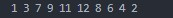
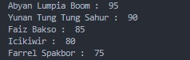
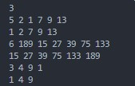
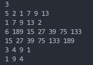
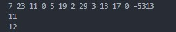
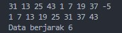
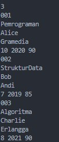

# <h1 align="center">Laporan Praktikum Modul 12 & 13 <br> PENGURUTAN DATA</h1>
<p align="center">Cholid Afiddrus Wijayanto - 103112430012</p>

## Dasar Teori

Pengurutan data adalah proses menyusun data dalam urutan tertentu (menaik atau menurun). Selection Sort bekerja dengan mencari nilai terkecil/terbesar dan menukarnya ke posisi yang benar, sedangkan Insertion Sort mengambil satu elemen dan menyisipkannya ke posisi yang tepat di bagian yang sudah terurut. Kedua algoritma ini memiliki kompleksitas waktu O(n²) namun efektif untuk data berukuran kecil.

## Guided
### Soal 1. Urut Ganjil Genap

Diberikan `n` bilangan bulat positif. Buat program untuk mengurutkan angka ganjil secara **membesar (ascending)** dan angka genap secara **mengecil (descending)**, lalu gabungkan hasilnya dengan ganjil duluan.

Gunakan **selection sort** dalam proses pengurutan.

**Masukan:**

- Baris pertama berisi bilangan bulat `n` (1 ≤ n ≤ 100).
- Baris kedua berisi `n` bilangan bulat positif.

**Keluaran:**

- Satu baris berisi angka ganjil terurut membesar diikuti angka genap terurut mengecil.

```go
package main

  

import "fmt"

  

func selectionSortAsc(arr []int, panjang int) {

    var temp, i, j, idxMin int

    for i = 0; i < panjang-1; i++ {

        idxMin = i

        for j = i + 1; j < panjang; j++ {

            if arr[j] < arr[idxMin] {

                idxMin = j

            }

        }

        temp = arr[idxMin]

        arr[idxMin] = arr[i]

        arr[i] = temp

    }

}

  

func selectionSortDesc(arr []int, panjang int) {

    var temp, i, j, idxMax int

    for i = 0; i < panjang-1; i++ {

        idxMax = i

        for j = i + 1; j < panjang; j++ {

            if arr[j] > arr[idxMax] {

                idxMax = j

            }

        }

        temp = arr[idxMax]

        arr[idxMax] = arr[i]

        arr[i] = temp

    }

}

  

func main() {

    n := 10

    numbers := []int{12, 7, 3, 2, 9, 6, 8, 1, 11, 4}

  

    var ganjil []int

    var genap []int

  

    for i := 0; i < n; i++ {

        if numbers[i]%2 == 1 {

            ganjil = append(ganjil, numbers[i])

        } else {

            genap = append(genap, numbers[i])

        }

    }

  

    selectionSortAsc(ganjil, len(ganjil))

    selectionSortDesc(genap, len(genap))

  

    for i := 0; i < len(ganjil); i++ {

        fmt.Print(ganjil[i], " ")

    }

    for i := 0; i < len(genap); i++ {

        fmt.Print(genap[i], " ")

    }

}
```

**Output:**



Program di atas merupakan program yang digunakan untuk mengurutkan bilangan ganjil secara ascending (membesar) dan bilangan genap secara descending (mengecil), kemudian menampilkannya dengan bilangan ganjil lebih dahulu. Program menerima masukan `n` bilangan bulat positif, lalu memisahkan bilangan-bilangan tersebut menjadi dua kelompok berdasarkan sifat bilangan (ganjil atau genap). Proses pemisahan dilakukan dengan memeriksa sisa hasil bagi setiap bilangan dengan 2. Jika sisa hasil bagi adalah 1, maka bilangan tersebut dimasukkan ke array `ganjil`, jika sisa hasil bagi adalah 0, bilangan dimasukkan ke array `genap`. Setelah proses pemisahan, program melakukan pengurutan menggunakan algoritma Selection Sort dengan fungsi `selectionSortAsc` untuk bilangan ganjil dan `selectionSortDesc` untuk bilangan genap. Kedua algoritma tersebut mencari nilai ekstrim pada setiap iterasi dan menukarkannya dengan elemen di posisi yang seharusnya. Terakhir, program menampilkan hasil pengurutan dengan mencetak array `ganjil` terlebih dahulu diikuti dengan array `genap`, sesuai dengan spesifikasi soal yang diminta.

### Soal 2. Ranking Nilai Ujian

Sebuah kelas memiliki sejumlah siswa yang telah mengikuti ujian. Tugas Anda adalah membuat program yang membaca nilai-nilai ujian siswa dengan struct berisikan `nim` dan `nilai`, lalu mengurutkannya dari yang tertinggi ke yang terendah menggunakan **insertion sort**.

**Masukan:**

- Baris pertama adalah sebuah bilangan bulat `n` (1 ≤ n ≤ 100), menyatakan jumlah siswa.
- Baris berikutnya berisi `n` bilangan bulat yang masing-masing adalah nilai ujian (0–100).
   
**Keluaran:**

- Satu baris berisi nilai-nilai yang sudah terurut dari terbesar ke terkecil.

```go
package main

  

import "fmt"

  

type identitas struct {

    nama  string

    nilai int

}

  

func nilaiujian(arr []identitas) {

    var temp identitas

    for i := 1; i < len(arr); i++ {

        temp = arr[i]

        j := i

  

        for j > 0 && temp.nilai > arr[j-1].nilai {

            arr[j] = arr[j-1]

            j--

        }

  

        arr[j] = temp

    }

}

  

func main() {

    orang := []identitas{

        {"Farrel Spakbor", 75},

        {"Yunan Tung Tung Sahur", 90},

        {"Faiz Bakso", 85},

        {"Abyan Lumpia Boom", 95},

        {"Icikiwir", 80},

    }

  

    nilaiujian(orang)

  

    for i := 0; i < len(orang); i++ {

        fmt.Println(orang[i].nama, ": ", orang[i].nilai)

    }

}
```

**Output:**



Program di atas merupakan program yang digunakan untuk mengurutkan data nilai ujian siswa dari yang tertinggi ke terendah menggunakan algoritma Insertion Sort. Program ini menggunakan struktur data `struct` bernama `identitas` yang berisi dua field, yaitu `nama` untuk menyimpan nama siswa dan `nilai` untuk menyimpan nilai ujian siswa. Fungsi utama dalam program ini adalah `nilaiujian()` yang mengimplementasikan algoritma Insertion Sort untuk mengurutkan array bertipe `identitas` berdasarkan field `nilai` secara menurun (descending). Cara kerja algoritma ini adalah dengan membagi array menjadi dua bagian: bagian yang sudah terurut dan bagian yang belum terurut. Pada setiap iterasi, satu elemen dari bagian yang belum terurut diambil dan disisipkan ke posisi yang tepat di bagian yang sudah terurut. Proses ini dilakukan dengan membandingkan nilai elemen tersebut dengan nilai elemen-elemen di bagian yang sudah terurut, lalu menggeser elemen-elemen yang nilainya lebih kecil untuk memberi tempat pada elemen yang sedang disisipkan. Setelah proses pengurutan selesai, program menampilkan nama dan nilai setiap siswa secara berurutan dari nilai tertinggi ke terendah.


## Unguided

### Soal 1

Hercules, preman terkenal seantero ibukota, memiliki kerabat di banyak daerah. Tentunya Hercules sangat suka mengunjungi semua kerabatnya itu. Diberikan masukan nomor rumah dari semua kerabatnya di suatu daerah, buatlah program rumahkerabat yang akan menyusun nomor-nomor rumah kerabatnya secara terurut membesar menggunakan algoritma selection sort. Masukan dimulai dengan sebuah integer 𝒏 (0 < n < 1000), banyaknya daerah kerabat Hercules tinggal. Isi 𝒏 baris berikutnya selalu dimulai dengan sebuah integer 𝒎 (0 < m < 1000000) yang menyatakan banyaknya rumah kerabat di daerah tersebut, diikuti dengan rangkaian bilangan bulat positif, nomor rumah para kerabat. Keluaran terdiri dari n baris, yaitu rangkaian rumah kerabatnya terurut membesar di masingmasing daerah.

```go
package main

  

import "fmt"

  

func selectionSortAsc(arr []int, panjang int) {

    var temp, i, j, idxMin int

    for i = 0; i < panjang-1; i++ {

        idxMin = i

        for j = i + 1; j < panjang; j++ {

            if arr[j] < arr[idxMin] {

                idxMin = j

            }

        }

        temp = arr[idxMin]

        arr[idxMin] = arr[i]

        arr[i] = temp

    }

}

  

func main() {

    var n int

    fmt.Scan(&n)

  

    for i := 0; i < n; i++ {

        var m int

        fmt.Scan(&m)

  

        rumah := make([]int, m)

        for j := 0; j < m; j++ {

            fmt.Scan(&rumah[j])

        }

  

        selectionSortAsc(rumah, m)

  

        for j := 0; j < m; j++ {

            fmt.Print(rumah[j])

            if j < m-1 {

                fmt.Print(" ")

            }

        }

        fmt.Println()

    }

}```

**Output:**




Program di atas merupakan program yang digunakan untuk mengurutkan nomor-nomor rumah kerabat Hercules di beberapa daerah menggunakan algoritma selection sort. User memasukkan jumlah daerah (n), lalu untuk setiap daerah memasukkan jumlah rumah kerabat (m) diikuti dengan nomor-nomor rumah. Program akan mengurutkan nomor rumah dari yang terkecil hingga terbesar untuk setiap daerah dan menampilkan hasilnya.
### Soal 2

Belakangan diketahui ternyata Hercules itu tidak berani menyeberang jalan, maka selalu diusahakan agar hanya menyeberang jalan sesedikit mungkin, hanya diujung jalan. Karena nomor rumah sisi kiri jalan selalu ganjil dan sisi kanan jalan selalu genap, maka buatlah program kerabat dekat yang akan menampilkan nomor rumah mulai dari nomor yang ganjil lebih dulu terurut membesar dan kemudian menampilkan nomor rumah dengan nomor genap terurut mengecil. Format Masukan masih persis sama seperti sebelumnya. Keluaran terdiri dari n baris, yaitu rangkaian rumah kerabatnya terurut membesar untuk nomor ganjil, diikuti dengan terurut mengecil untuk nomor genap, di masing-masing daerah

```go
package main

  

import "fmt"

  

func selectionSortAsc(arr []int, panjang int) {

    var temp, i, j, idxMin int

    for i = 0; i < panjang-1; i++ {

        idxMin = i

        for j = i + 1; j < panjang; j++ {

            if arr[j] < arr[idxMin] {

                idxMin = j

            }

        }

        temp = arr[idxMin]

        arr[idxMin] = arr[i]

        arr[i] = temp

    }

}

  

func selectionSortDesc(arr []int, panjang int) {

    var temp, i, j, idxMax int

    for i = 0; i < panjang-1; i++ {

        idxMax = i

        for j = i + 1; j < panjang; j++ {

            if arr[j] > arr[idxMax] {

                idxMax = j

            }

        }

        temp = arr[idxMax]

        arr[idxMax] = arr[i]

        arr[i] = temp

    }

}

  

func main() {

    var n, m, x int

    var i, j int

    var ganjil [1000]int

    var genap [1000]int

    var jmlGanjil, jmlGenap int

  

    fmt.Scan(&n) // jumlah daerah

  

    for i = 0; i < n; i++ {

        fmt.Scan(&m)

        jmlGanjil = 0

        jmlGenap = 0

        for j = 0; j < m; j++ {

            fmt.Scan(&x)

            if x%2 == 1 {

                ganjil[jmlGanjil] = x

                jmlGanjil++

            } else {

                genap[jmlGenap] = x

                jmlGenap++

            }

        }

  

        selectionSortAsc(ganjil[:], jmlGanjil)

        selectionSortDesc(genap[:], jmlGenap)

  

        for j = 0; j < jmlGanjil; j++ {

            fmt.Printf("%d ", ganjil[j])

        }

        for j = 0; j < jmlGenap; j++ {

            fmt.Printf("%d ", genap[j])

        }

        fmt.Println()

    }

}
```

**Output:**



Program di atas merupakan program yang digunakan untuk mengurutkan nomor-nomor rumah kerabat Hercules berdasarkan aturan khusus. User diminta memasukkan jumlah daerah, jumlah rumah kerabat di setiap daerah, dan nomor-nomor rumah tersebut. Program ini memisahkan nomor rumah menjadi dua kelompok: bilangan ganjil dan bilangan genap. Pemisahan dilakukan saat membaca input dengan memeriksa sisa pembagian setiap nomor rumah dengan 2. Jika hasilnya 1, nomor tersebut ganjil dan disimpan di array ganjil, jika hasilnya 0, nomor tersebut genap dan disimpan di array genap. Program menggunakan dua fungsi pengurutan selection sort yang berbeda: selectionSortAsc untuk mengurutkan bilangan ganjil secara menaik (ascending) dan selectionSortDesc untuk mengurutkan bilangan genap secara menurun (descending). Setelah pengurutan, program menampilkan hasil dengan mencetak semua nomor ganjil terlebih dahulu (dari kecil ke besar), diikuti dengan semua nomor genap (dari besar ke kecil), dipisahkan oleh spasi. Kesimpulannya, program ini digunakan untuk membantu Hercules yang takut menyeberang jalan dengan mengurutkan nomor rumah kerabatnya sedemikian rupa sehingga dia dapat mengunjungi semua rumah dengan nomor ganjil (sisi kiri jalan) dari kecil ke besar, lalu mengunjungi semua rumah dengan nomor genap (sisi kanan jalan) dari besar ke kecil, yang memungkinkan dia menyeberang jalan seminimal mungkin.

### Soal 3

Kompetisi pemrograman yang baru saja berlalu diikuti oleh 17 tim dari berbagai perguruan tinggi ternama. Dalam kompetisi tersebut, setiap tim berlomba untuk menyelesaikan sebanyak mungkin problem yang diberikan. Dari 13 problem yang diberikan, ada satu problem yang menarik. Problem tersebut mudah dipahami, hampir semua tim mencoba untuk menyelesaikannya, tetapi hanya 3 tim yang berhasil. Apa sih problemnya? "Median adalah nilai tengah dari suatu koleksi data yang sudah terurut. Jika jumlah data genap, maka nilai median adalah rerata dari kedua nilai tengahnya. Pada problem ini, semua data merupakan bilangan bulat positif, dan karenanya rerata nilai tengah dibulatkan ke bawah." Buatlah program median yang mencetak nilai median terhadap seluruh data yang sudah terbaca, jika data yang dibaca saat itu adalah 0. Masukan berbentuk rangkaian bilangan bulat. Masukan tidak akan berisi lebih dari 1000000 data, tidak termasuk bilangan 0. Data 0 merupakan tanda bahwa median harus dicetak, tidak termasuk data yang dicari mediannya. Data masukan diakhiri dengan bilangan bulat -5313. Keluaran adalah median yang diminta, satu data per baris.

```go
package main

  

import (

    "fmt"

)

  

func insertionSort(T []int) {

    for i := 1; i < len(T); i++ {

        temp := T[i]

        j := i

        for j > 0 && temp < T[j-1] {

            T[j] = T[j-1]

            j--

        }

        T[j] = temp

    }

}

  

func hitungMedian(data []int) int {

    n := len(data)

    if n%2 == 1 {

        return data[n/2]

    }

    return (data[n/2-1] + data[n/2]) / 2

}

  

func main() {

    var input int

    var data []int

  

    for {

        fmt.Scan(&input)

        if input == -5313 {

            break

        } else if input == 0 {

            temp := make([]int, len(data))

            copy(temp, data)

            insertionSort(temp)

            fmt.Println(hitungMedian(temp))

        } else {

            data = append(data, input)

        }

    }

}
```

**Output:**



Program di atas merupakan program yang digunakan untuk menghitung nilai median dari sekumpulan data bilangan bulat positif. User memasukkan sejumlah bilangan secara berurutan, dan program akan menghitung dan menampilkan nilai median dari seluruh data yang sudah dimasukkan setiap kali angka 0 diinputkan. Program ini menggunakan slice dinamis untuk menyimpan data input dan memproses input secara terus-menerus hingga ditemukan penanda akhir -5313. Setiap kali menerima angka 0, program membuat salinan dari data yang telah terkumpul dengan fungsi copy(), lalu mengurutkannya menggunakan algoritma insertion sort. Proses insertion sort bekerja dengan membandingkan setiap elemen data dengan elemen-elemen sebelumnya yang sudah terurut, lalu menyisipkannya pada posisi yang tepat. Setelah data terurut, fungsi hitungMedian dipanggil untuk menentukan nilai median sesuai aturan: jika jumlah data ganjil, median adalah nilai tengah dari data terurut, sedangkan jika jumlah data genap, median dihitung sebagai rata-rata dua nilai tengah yang dibulatkan ke bawah dengan pembagian integer. Kesimpulannya, program ini digunakan untuk menghitung nilai median secara dinamis dari sekumpulan data dengan memanfaatkan teknik pengurutan insertion sort dan perhitungan nilai tengah yang berbeda untuk jumlah data ganjil dan genap.

### Soal 4

Buatlah sebuah program yang digunakan untuk membaca data integer seperti contoh yang diberikan di bawah ini, kemudian diurutkan (menggunakan metoda insertion sort), dan memeriksa apakah data yang terurut berjarak sama terhadap data sebelumnya. Masukan terdiri dari sekumpulan bilangan bulat yang diakhiri oleh bilangan negatif. Hanya bilangan non negatif saja yang disimpan ke dalam array. Keluaran terdiri dari dua baris. Baris pertama adalah isi dari array setelah dilakukan pengurutan, sedangkan baris kedua adalah status jarak setiap bilangan yang ada di dalam array. "Data berjarak x" atau "data berjarak tidak tetap".

```go
package main

  

import (

    "fmt"

)

  

func insertionSort(arr []int) {

    for i := 1; i < len(arr); i++ {

        temp := arr[i]

        j := i

        for j > 0 && temp < arr[j-1] {

            arr[j] = arr[j-1]

            j--

        }

        arr[j] = temp

    }

}

  

func isJarakTetap(arr []int) (bool, int) {

    if len(arr) < 2 {

        return true, 0

    }

    selisih := arr[1] - arr[0]

    for i := 2; i < len(arr); i++ {

        if arr[i]-arr[i-1] != selisih {

            return false, 0

        }

    }

    return true, selisih

}

  

func main() {

    var input int

    var data []int

  

    for {

        fmt.Scan(&input)

        if input < 0 {

            break

        }

        data = append(data, input)

    }

  

    insertionSort(data)

  

    for _, v := range data {

        fmt.Printf("%d ", v)

    }

    fmt.Println()

  

    ok, selisih := isJarakTetap(data)

    if ok {

        fmt.Printf("Data berjarak %d\n", selisih)

    } else {

        fmt.Println("Data berjarak tidak tetap")

    }

}
```

**Output:**


.jpg)

Program di atas merupakan program yang digunakan untuk mengurutkan sekumpulan bilangan dan memeriksa apakah bilangan-bilangan tersebut memiliki jarak yang sama setelah diurutkan. User diminta memasukkan sejumlah bilangan bulat non-negatif hingga ditemukan bilangan negatif yang menandakan akhir dari input. Program menyimpan semua bilangan non-negatif ini ke dalam slice dinamis, kemudian mengurutkannya menggunakan algoritma insertion sort. Insertion sort bekerja dengan membandingkan setiap elemen dengan elemen-elemen sebelumnya yang sudah terurut, dan menyisipkannya ke posisi yang tepat. Setelah data terurut, program menampilkan data tersebut, kemudian memanggil fungsi isJarakTetap untuk memeriksa apakah selisih antara setiap dua bilangan berurutan selalu sama. Fungsi ini bekerja dengan mengambil selisih antara dua elemen pertama sebagai patokan, lalu memeriksa apakah selisih yang sama berlaku untuk seluruh pasangan elemen berurutan dalam array. Jika semua jarak sama, program mencetak "Data berjarak x" dimana x adalah nilai selisih tersebut; jika tidak, program mencetak "Data berjarak tidak tetap". Kesimpulannya, program ini digunakan untuk menentukan apakah sekumpulan bilangan membentuk barisan aritmatika setelah diurutkan, dengan memanfaatkan algoritma insertion sort dan pengecekan selisih antar elemen berurutan.

### Soal 5

Sebuah program perpustakaan digunakan untuk mengelola data buku di dalam suatu perpustakaan. Misalnya terdefinisi struct dan array seperti berikut ini: const nMax : integer = 7919 type Buku = < id, judul, penulis, penerbit : string eksemplar, tahun, rating : integer > type DaftarBuku = array [ 1..nMax] of Buku Pustaka : DaftarBuku nPustaka: integer Masukan terdiri dari beberapa baris. Baris pertama adalah bilangan bulat N yang menyatakan banyaknya data buku yang ada di dalam perpustakaan. N baris berikutnya, masing-masingnya adalah data buku sesuai dengan atribut atau field pada struct. Baris terakhir adalah bilangan bulat yang menyatakan rating buku yang akan dicari. Keluaran terdiri dari beberapa baris. Baris pertama adalah data buku terfavorit, baris kedua adalah lima judul buku dengan rating tertinggi, selanjutnya baris terakhir adalah data buku yang dicari sesuai rating yang diberikan pada masukan baris terakhir.

```go
package main

  

import "fmt"

  

const nMax int = 7919

  

type Buku struct {

    id, judul, penulis, penerbit string

    eksemplar, tahun, rating     int

}

  

type DaftarBuku [nMax]Buku

  

func DaftarkanBuku(pustaka *DaftarBuku, n int) {

    var i int

    i = 0

    for i < n {

        fmt.Scan(&pustaka[i].id)

        fmt.Scan(&pustaka[i].judul)

        fmt.Scan(&pustaka[i].penulis)

        fmt.Scan(&pustaka[i].penerbit)

        fmt.Scan(&pustaka[i].eksemplar)

        fmt.Scan(&pustaka[i].tahun)

        fmt.Scan(&pustaka[i].rating)

        i = i + 1

    }

}

  

func CetakTerfavorit(pustaka DaftarBuku, n int) {

    var idxMax, i int

    idxMax = 0

    i = 1

    for i < n {

        if pustaka[i].rating > pustaka[idxMax].rating {

            idxMax = i

        }

        i = i + 1

    }

    fmt.Println(pustaka[idxMax].judul, pustaka[idxMax].penulis,

        pustaka[idxMax].penerbit, pustaka[idxMax].tahun)

}

  

func UrutBuku(pustaka *DaftarBuku, n int) {

    var temp Buku

    var i, j int

    i = 1

    for i < n {

        j = i

        temp = pustaka[j]

        for j > 0 && temp.rating > pustaka[j-1].rating {

            pustaka[j] = pustaka[j-1]

            j = j - 1

        }

        pustaka[j] = temp

        i = i + 1

    }

}

  

func Cetak5Terbaru(pustaka DaftarBuku, n int) {

    var i, batas int

    if n < 5 {

        batas = n

    } else {

        batas = 5

    }

    i = 0

    for i < batas {

        fmt.Println(pustaka[i].judul)

        i = i + 1

    }

}

  

func CariBuku(pustaka DaftarBuku, n int, r int) {

    var kiri, kanan, tengah int

    var ketemu bool

  

    kiri = 0

    kanan = n - 1

    ketemu = false

  

    for kiri <= kanan && !ketemu {

        tengah = (kiri + kanan) / 2

        if pustaka[tengah].rating == r {

            ketemu = true

        } else if pustaka[tengah].rating > r {

            kiri = tengah + 1

        } else {

            kanan = tengah - 1

        }

    }

  

    if ketemu {

        fmt.Println(pustaka[tengah].judul, pustaka[tengah].penulis,

            pustaka[tengah].penerbit, pustaka[tengah].tahun,

            pustaka[tengah].eksemplar, pustaka[tengah].rating)

    } else {

        fmt.Println("Tidak ada buku dengan rating seperti itu")

    }

}

  

func main() {

    var pustaka DaftarBuku

    var n, ratingCari int

  

    fmt.Scan(&n)

    DaftarkanBuku(&pustaka, n)

    CetakTerfavorit(pustaka, n)

    UrutBuku(&pustaka, n)

    Cetak5Terbaru(pustaka, n)

    fmt.Scan(&ratingCari)

    CariBuku(pustaka, n, ratingCari)

}
```

**Output:**


.jpg)

Program di atas merupakan program pengelolaan perpustakaan yang digunakan untuk mendata, mengurutkan, dan mencari buku berdasarkan ratingnya. User diminta memasukkan jumlah buku (n) dan data masing-masing buku (id, judul, penulis, penerbit, eksemplar, tahun, dan rating), serta rating buku yang ingin dicari. Program ini menggunakan struktur data array dan struct untuk menyimpan informasi buku, dengan array bertipe DaftarBuku yang memiliki kapasitas maksimum 7919 elemen. Program terdiri dari lima fungsi utama: DaftarkanBuku untuk memasukkan data buku ke dalam array, CetakTerfavorit untuk menampilkan buku dengan rating tertinggi menggunakan pencarian nilai maksimum, UrutBuku untuk mengurutkan buku berdasarkan rating secara menurun menggunakan algoritma insertion sort, Cetak5Terbaru untuk menampilkan 5 judul buku dengan rating tertinggi (atau seluruh buku jika jumlahnya kurang dari 5), dan CariBuku untuk mencari buku dengan rating tertentu menggunakan algoritma pencarian biner. Kesimpulannya, program ini digunakan untuk mengelola data perpustakaan dengan memanfaatkan beberapa algoritma penting dalam ilmu komputer seperti insertion sort untuk pengurutan dan binary search untuk pencarian, serta menampilkan informasi buku terfavorit, lima buku dengan rating tertinggi, dan buku dengan rating yang dicari oleh user.