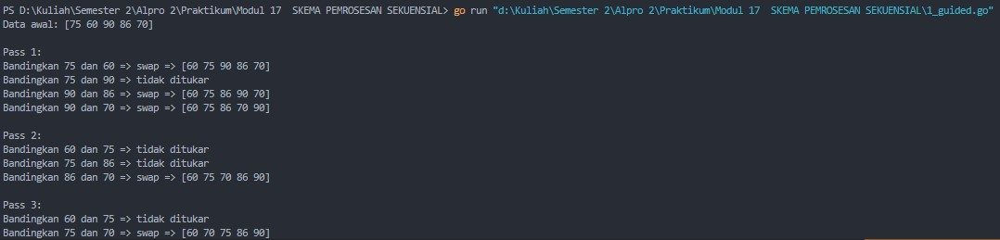
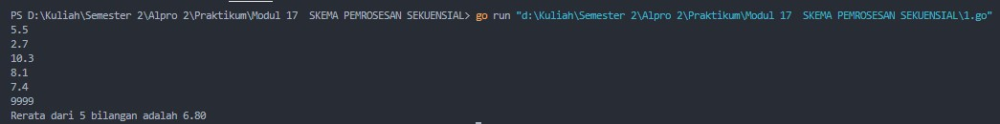
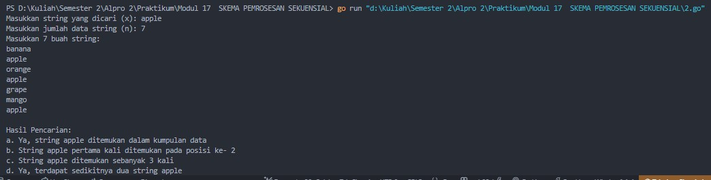
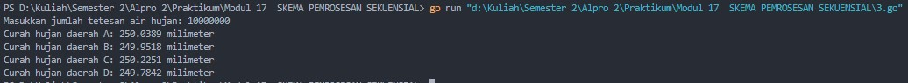
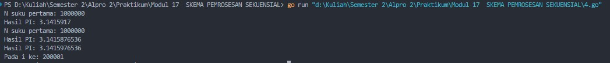
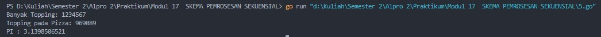

# <h1 align="center">Laporan Praktikum Modul 17 <br> SKEMA PEMROSESAN SEKUENSIAL</h1>
<p align="center">Cholid Afiddrus Wijayanto - 103112430012</p>

## Dasar Teori

Skema pemrosesan sekuensial adalah pola algoritma untuk memproses data berurutan dengan variasi berupa pembacaan tanpa marker (menggunakan counter), dengan marker (berhenti saat nilai khusus ditemui), penanganan kasus kosong, dan pemrosesan elemen pertama secara khusus. Variasi-variasi ini memungkinkan pengolahan data yang efektif dalam berbagai skenario dan merupakan teknik fundamental dalam pemrograman.

## Guided
### Soal 1

Aldi memiliki daftar nilai ulangan matematika temannya: 75, 60, 90, 85, dan 70. Ia ingin mengurutkan nilai tersebut dari yang terkecil ke yang terbesar menggunakan **metode Bubble Sort**.

**Pertanyaan:**
1. Tunjukkan proses pengurutan nilai menggunakan Bubble Sort **hingga semua nilai terurut.**
2. Berapa kali pertukaran (swap) terjadi dalam proses ini?

**Keluaran:**
- Satu baris berisi angka ganjil terurut membesar diikuti angka genap terurut mengecil.

```go
package main

import (
    "fmt"
)

func main() {
    // Daftar nilai ulangan
    nilai := []int{75, 60, 90, 86, 70}
    jumlahSwap := 0
    n := len(nilai)

    fmt.Println("Data awal:", nilai)

    // Proses Bubble Sort
    for i := 0; i < n-1; i++ {
        swapped := false
        fmt.Printf("\nPass %d:\n", i+1)

        for j := 0; j < n-1-i; j++ {
            fmt.Printf("Bandingkan %d dan %d", nilai[j], nilai[j+1])
            if nilai[j] > nilai[j+1] {
                // Tukar nilai jika urutannya salah
                nilai[j], nilai[j+1] = nilai[j+1], nilai[j]
                jumlahSwap++
                swapped = true
                fmt.Printf(" => swap => %v\n", nilai)
            } else {
                fmt.Println(" => tidak ditukar")
            }
        }

        if !swapped {
            break // Sudah terurut, keluar dari loop
        }
    }
    
    fmt.Println("\nData setelah diurutkan:", nilai)
    fmt.Println("Jumlah pertukaran (swap):", jumlahSwap)
}
```

**Output:**


_guided.jpg)

Program di atas merupakan program yang digunakan untuk mengurutkan data nilai ulangan matematika menggunakan metode _Bubble Sort_. Dalam program ini, nilai-nilai awal disimpan dalam slice dan akan diurutkan dari yang terkecil ke terbesar. Proses pengurutan dilakukan dengan memanfaatkan perulangan for bersarang, di mana setiap elemen dibandingkan dengan elemen di sebelah kanannya. Jika urutan salah (nilai kiri lebih besar dari nilai kanan), maka kedua nilai tersebut ditukar. Setiap proses pertukaran atau _swap_ dicatat untuk mengetahui berapa kali proses tersebut terjadi. Selain itu, program juga menampilkan hasil dari setiap _pass_ agar pengguna dapat melihat perkembangan proses pengurutan secara bertahap. Jika dalam satu _pass_ tidak ada pertukaran, maka proses akan berhenti lebih awal karena data sudah dalam kondisi terurut. Kesimpulannya, program ini digunakan untuk mengurutkan nilai menggunakan logika _Bubble Sort_, dengan memanfaatkan perulangan bersarang dan logika pertukaran data sebagai bentuk komposisi kode yang saling terhubung.


## Unguided

### Soal 1

Diberikan sejumlah bilangan real yang diakhiri dengan marker 9999, cari rerata dari bilanganbilangan tersebut.

```go
package main

import (
    "fmt"
)

func main() {
    var dat float64
    var sum float64 = 0
    var count int = 0
  
    fmt.Scan(&dat)
  
    // Marker untuk stop membaca data
    const MARKER float64 = 9999
  
    for dat != MARKER {
        sum += dat
        count++
        fmt.Scan(&dat)
    }

    if count == 0 {
        fmt.Println("Tidak ada data yang valid")
    } else {
        rerata := sum / float64(count)
        fmt.Printf("Rerata dari %d bilangan adalah %.2f\n", count, rerata)
    }
}
```

**Output:**




Program diatas merupakan program yang digunakan untuk menghitung rerata dari sekumpulan bilangan real yang diakhiri dengan marker 9999. User diminta memasukkan sejumlah bilangan secara berurutan sampai user memasukkan 9999 sebagai penanda akhir data. Program ini mengimplementasikan skema pemrosesan sekuensial dengan marker, di mana program akan terus membaca bilangan selama bilangan tersebut bukan marker (9999). Untuk setiap bilangan yang bukan marker, program akan mengakumulasi nilai tersebut ke dalam variabel sum dan meningkatkan penghitung count. Setelah semua data dibaca, program akan memeriksa apakah count bernilai 0 (tidak ada data) atau tidak. Jika count tidak bernilai 0, program akan menghitung rerata dengan membagi total sum dengan jumlah data (count) dan menampilkan hasilnya. Kesimpulannya, program ini secara efektif menggunakan skema pemrosesan sekuensial dengan marker untuk memproses data secara dinamis dan menghitung rerata, tanpa perlu mengetahui jumlah data di awal.
### Soal 2

Diberikan string x dan n buah string. x adalah data pertama yang dibaca, n adalah data bilangan yang dibaca kedua, dan n data berikutnya adalah data string. Buat algoritma untuk menjawab pertanyaan berikut: 
a. Apakah string x ada dalam kumpulan n data string tersebut? 
b. Pada posisi ke berapa string x tersebut ditemukan?  
c. Ada berapakah string x dalam kumpulan n data string tersebut? 
d. Adakah sedikitnya dua string x dalam n data string tersebut?

```go
package main

import (
    "fmt"
)

func main() {
    var x string
    var n int
    var str string
    var count int = 0
    var found bool = false     // untuk menandakan apakah x ditemukan
    var firstPosition int = -1 // posisi pertama ditemukannya x (-1 jika tidak ditemukan)
    
    fmt.Print("Masukkan string yang dicari (x): ")
    fmt.Scan(&x)


    fmt.Print("Masukkan jumlah data string (n): ")
    fmt.Scan(&n)
  
    fmt.Println("Masukkan", n, "buah string:")
    for i := 1; i <= n; i++ {
        fmt.Scan(&str)

        if str == x {
            count++
            found = true // x ditemukan

            // Menyimpan posisi pertama ditemukannya x
            if firstPosition == -1 {
                firstPosition = i
            }
        }
    }
    fmt.Println("\nHasil Pencarian:")

    // a. Apakah string x ada dalam kumpulan n data string tersebut?
    if found {
        fmt.Println("a. Ya, string", x, "ditemukan dalam kumpulan data")
    } else {
        fmt.Println("a. Tidak, string", x, "tidak ditemukan dalam kumpulan data")
    }

    // b. Pada posisi ke berapa string x tersebut ditemukan?
    if firstPosition != -1 {
        fmt.Println("b. String", x, "pertama kali ditemukan pada posisi ke-", firstPosition)
    } else {
        fmt.Println("b. String", x, "tidak ditemukan")
    }

    // c. Ada berapakah string x dalam kumpulan n data string tersebut?
    fmt.Println("c. String", x, "ditemukan sebanyak", count, "kali")
  
    // d. Adakah sedikitnya dua string x dalam n data string tersebut?
    if count >= 2 {
        fmt.Println("d. Ya, terdapat sedikitnya dua string", x)
    } else {
        fmt.Println("d. Tidak, tidak terdapat sedikitnya dua string", x)
    }
}
```

**Output:**



Program diatas merupakan program yang digunakan untuk mencari keberadaan sebuah string dalam kumpulan data string. User diminta memasukkan string yang akan dicari (x) dan jumlah data string (n), kemudian user memasukkan n buah string. Program ini mengimplementasikan skema pemrosesan sekuensial tanpa marker karena jumlah data diketahui di awal. Program akan membaca n data string satu per satu, dan untuk setiap string yang dibaca, program akan memeriksa apakah string tersebut sama dengan string yang dicari (x). Selama pemrosesan, program mencatat beberapa informasi: apakah string x ditemukan (found), posisi pertama string x ditemukan (firstPosition), dan jumlah kemunculan string x (count). Setelah semua data dibaca, program akan menampilkan jawaban untuk empat pertanyaan yang diajukan dalam soal. Kesimpulannya, program ini menggunakan perulangan dan variabel penanda untuk melacak keberadaan string dalam kumpulan data, mendemonstrasikan penggunaan skema pemrosesan sekuensial yang efisien untuk pencarian data.

### Soal 3

Empat daerah A, B, C, dan D yang berdekatan ingin mengukur curah hujan. Keempat daerah tersebut digambarkan pada bidang berikut:  
Misal curah hujan dihitung berdasarkan banyaknya tetesan air hujan. Setiap tetesan berukuran 0.0001 ml curah hujan. Tetesan air hujan turun secara acak dari titik (0,0) sampai (1,1). Jika diterima input yang menyatakan banyaknya tetesan air hujan. Tentukan curah hujan untuk keempat daerah tersebut. Buatlah program yang menerima input berupa banyaknya tetesan air hujan. Kemudian buat koordinat/titik (x, y) secara acak dengan menggunakan fungsi rand.Float64(). Hitung dan tampilkan banyaknya tetesan yang jatuh pada daerah A, B, C dan D. Konversikan satu tetesan berukuran 0.0001 milimeter. Catatan: Lihat lampiran untuk informasi menggunakan paket math/rand untuk menggunakan rand.Float64() yang menghasilkan bilangan riil acak [0..1].

```go
package main

import (
    "fmt"
    "math/rand"
    "time"
)

func main() {
    // Inisialisasi generator bilangan acak dengan waktu saat ini
    rand.Seed(time.Now().UnixNano())

    var jumlahTetesan int
  
    fmt.Print("Masukkan jumlah tetesan air hujan: ")
    fmt.Scan(&jumlahTetesan)

    var daerahA, daerahB, daerahC, daerahD int

    for i := 0; i < jumlahTetesan; i++ {
        x := rand.Float64()
        y := rand.Float64()
        // Menentukan daerah tempat tetesan jatuh
        // Daerah A: x < 0.5 dan y >= 0.5
        // Daerah B: x >= 0.5 dan y >= 0.5
        // Daerah C: x < 0.5 dan y < 0.5
        // Daerah D: x >= 0.5 dan y < 0.5
        if x < 0.5 && y >= 0.5 {
            daerahA++
        } else if x >= 0.5 && y >= 0.5 {
            daerahB++
        } else if x < 0.5 && y < 0.5 {
            daerahC++
        } else { // x >= 0.5 && y < 0.5
            daerahD++
        }
    }


    // Konversi jumlah tetesan menjadi curah hujan dalam milimeter
    // 1 tetesan = 0.0001 milimeter
    curahHujanA := float64(daerahA) * 0.0001
    curahHujanB := float64(daerahB) * 0.0001
    curahHujanC := float64(daerahC) * 0.0001
    curahHujanD := float64(daerahD) * 0.0001

    fmt.Printf("Curah hujan daerah A: %.4f milimeter\n", curahHujanA)
    fmt.Printf("Curah hujan daerah B: %.4f milimeter\n", curahHujanB)
    fmt.Printf("Curah hujan daerah C: %.4f milimeter\n", curahHujanC)
    fmt.Printf("Curah hujan daerah D: %.4f milimeter\n", curahHujanD)
}
```

**Output:**



Program diatas merupakan program yang digunakan untuk menghitung curah hujan di empat daerah berdasarkan simulasi tetesan air hujan yang jatuh secara acak. User diminta memasukkan jumlah tetesan air hujan, lalu program akan mensimulasikan jatuhnya tetesan tersebut menggunakan metode Monte Carlo dengan menghasilkan koordinat acak (x, y) dalam rentang [0,1]. Program menentukan daerah tempat tetesan jatuh berdasarkan koordinat: Daerah A (x < 0.5, y >= 0.5), Daerah B (x >= 0.5, y >= 0.5), Daerah C (x < 0.5, y < 0.5), dan Daerah D (x >= 0.5, y < 0.5). Untuk setiap tetesan, program meningkatkan penghitung daerah yang sesuai. Setelah semua tetesan disimulasikan, program mengonversi jumlah tetesan menjadi curah hujan dalam milimeter (1 tetesan = 0.0001 milimeter) dan menampilkan hasil untuk setiap daerah. Kesimpulannya, program ini menggunakan kombinasi simulasi Monte Carlo dan skema pemrosesan sekuensial untuk menganalisis distribusi curah hujan di empat daerah berbeda, menunjukkan aplikasi praktis dari konsep komputasi probabilistik.

### Soal 4

Berdasarkan formula Leibniz, nilai π dapat dinyatakan sebagai deret harmonik ganti sebagai berikut: 1 − 1 3 + 1 5 − 1 7 + 1 9 − ⋯ = 𝜋 4 Suku ke-i dinyatakan sebagai 𝑆𝑖 dan jumlah deret adalah 𝑆. Apabila diketahui suku pertama 𝑆1 = 1, suku kedua 𝑆2 = −1 3 . Temukan rumus untuk suku ke-𝒊 atau 𝑆𝑖 . Berdasarkan rumus tersebut, buatlah program yang menghitung 𝑆 untuk 1000000 suku pertama.
Setelah jalan, modifikasi program tersebut agar menyimpan nilai dua suku yang bersebelahan, 𝑆𝑖 dan 𝑆𝑖+1. Buatlah agar program tersebut sekarang berhenti apabila selisih dari kedua suku tersebut tidak lebih dari 0.00001.

```go
package main

import (
    "fmt"
    "math"
)

func main() {
    // Bagian 1: Menghitung π dengan jumlah suku yang ditentukan
    var n int
    fmt.Print("N suku pertama: ")
    fmt.Scan(&n)

    // Rumus untuk suku ke-i pada deret Leibniz:
    // Si = (-1)^(i+1) / (2i-1)

    // Menghitung jumlah deret
    sum := 0.0
    for i := 1; i <= n; i++ {
        // Menghitung suku ke-i
        sign := math.Pow(-1, float64(i+1))
        denominator := 2*float64(i) - 1
        sum += sign / denominator
    }

    // Mengalikan dengan 4 untuk mendapatkan nilai π
    pi := 4 * sum
    fmt.Printf("Hasil PI: %.7f\n", pi)

    // Bagian 2: Menghitung π sampai perbedaan dua suku berurutan < 0.00001
    fmt.Printf("N suku pertama: %d\n", n)

    sum = 0.0
    var i int = 1
    var diff float64 = 1.0 // inisialisasi dengan nilai besar
    var prevPi, currPi float64

    for i <= n && diff > 0.00001 {
        sign := math.Pow(-1, float64(i+1))
        denominator := 2*float64(i) - 1
        term := sign / denominator
  
        sum += term
        currPi = 4 * sum

        if i > 1 {
            diff = math.Abs(currPi - prevPi)
        }

        prevPi = currPi
        i++
    }

    fmt.Printf("Hasil PI: %.10f\n", prevPi)
    fmt.Printf("Hasil PI: %.10f\n", currPi)
    fmt.Printf("Pada i ke: %d\n", i-1)
}
```

**Output:**



Program diatas merupakan program yang digunakan untuk menghitung nilai π menggunakan deret Leibniz. User diminta memasukkan jumlah suku (n) yang akan digunakan dalam perhitungan. Program terdiri dari dua bagian utama: pertama, menghitung π dengan jumlah suku yang ditentukan menggunakan rumus suku ke-i: Si = (-1)^(i+1) / (2i-1), dan kedua, menghitung π sampai perbedaan dua suku berurutan kurang dari 0.00001. Pada bagian pertama, program menggunakan perulangan for untuk menjumlahkan n suku pertama dari deret Leibniz, kemudian mengalikan jumlah tersebut dengan 4 untuk mendapatkan nilai π. Pada bagian kedua, program kembali menghitung nilai π tetapi dengan kondisi berhenti tambahan, yaitu ketika perbedaan absolut antara dua nilai π berurutan kurang dari 0.00001 atau ketika sudah mencapai n suku. Kesimpulannya, program ini menunjukkan implementasi deret tak hingga untuk aproksimasi numerik dari konstanta matematika π, dengan dua pendekatan berbeda: satu berbasis jumlah suku tetap dan satu berbasis konvergensi, menggambarkan penggunaan skema pemrosesan sekuensial dalam konteks komputasi matematika.

### Soal 5

Monti bekerja pada sebuah kedai pizza, saking ramainya kedai tersebut membuat Monti tidak ada waktu untuk bersantai. Suatu ketika saat sedang menaburkan topping pada pizza yang diletakkan pada wadah berbentuk persegi, terpikirkan oleh Monti cara menghitung berapa banyak topping yang dia butuhkan, dan cara menghitung nilai 𝝅. Ilustrasi seperti gambar yang diberikan di bawah, topping adalah lingkaran-lingkaran kecil. Ada yang tepat berada di atas pizza, dan ada yang jatuh di dalam kotak tetapi berada di luar pizza. Apabila luas pizza yang memiliki radius r adalah 𝐿𝑢𝑎𝑠𝑃𝑖𝑧𝑧𝑎 = 𝜋𝑟 2 dan luas wadah pizza yang memiliki panjang sisi 𝑑 = 2𝑟 adalah 𝐿𝑢𝑎𝑠𝑊𝑎𝑑𝑎ℎ = 𝑑 2 = 4𝑟 2 , maka diperoleh perbandingan luas kedua bidang tersebut 𝐿𝑢𝑎𝑠𝑃𝑖𝑧𝑧𝑎 𝐿𝑢𝑎𝑠𝑊𝑎𝑑𝑎ℎ = 𝜋𝑟 2 4𝑟 2 = 𝜋 4 Persamaan lingkaran adalah (𝑥 − 𝑥𝑐) 2 + (𝑦 − 𝑦𝑐) 2 = 𝑟 2 dengan titik pusat lingkaran adalah (𝑥𝑐 , 𝑦𝑐). Suatu titik sembarang (𝑥, 𝑦) dikatakan berada di dalam lingkaran apabila memenuhi ketidaksamaan: (𝑥 − 𝑥𝑐) 2 + (𝑦 − 𝑦𝑐) 2 ≤ 𝑟 2 Pada ilustrasi topping berbentuk bulat kecil merah dan biru pada gambar adalah titik-titik (𝑥, 𝑦) acak pada sebuah wadah yang berisi pizza. Dengan jumlah yang sangat banyak dan ditaburkan merata (secara acak), maka kita bisa mengetahui berapa banyak titik/topping yang berada tepat di dalam pizza menggunakan ketidaksamaan di atas. Buatlah program yang menerima input berupa banyaknya topping yang akan ditaburkan, kemudian buat titik acak (𝑥, 𝑦) dari bilangan acak riil pada kisaran nilai 0 hingga 1 sebanyak topping yang diberikan. Hitung dan tampilkan berapa banyak topping yang jatuh tepat di atas pizza. Titik pusat pizza adalah (0.5, 0.5) dan jari-jari pizza adalah 0.5 satuan wadah.
Apabila topping yang ditaburkan oleh Monti secara merata berjumlah yang sangat banyak, maka topping akan menutupi keseluruhan wadah pizza. Luas Pizza sebanding dengan topping yang berada pada pizza, sedangkan Luas Wadah sebanding dengan banyaknya topping yang ditaburkan. Dengan menggunakan rumus perbandingan luas yang diberikan di atas, maka nilai konstanta 𝜋 dapat dihitung. Modifikasi program di atas sehingga dapat menghitung dan menampilkan nilai konstanta π.

```go
package main

import (
    "fmt"
    "math"
    "math/rand"
    "time"
) 

func main() {
    // Inisialisasi generator bilangan acak dengan waktu saat ini
    rand.Seed(time.Now().UnixNano())
    
    var banyakTopping int
    fmt.Print("Banyak Topping: ")
    fmt.Scan(&banyakTopping)

    // Pizza memiliki titik pusat (0.5, 0.5) dan jari-jari 0.5
    // Topping berada di dalam pizza jika:
    // (x - 0.5)^2 + (y - 0.5)^2 <= 0.5^2

    var toppingPadaPizza int

    for i := 0; i < banyakTopping; i++ {
        // Menghasilkan koordinat acak (x, y) dalam rentang [0,1]
        x := rand.Float64()
        y := rand.Float64()

        // Menghitung jarak dari titik (x, y) ke pusat pizza (0.5, 0.5)
        dx := x - 0.5
        dy := y - 0.5
        distance := math.Sqrt(dx*dx + dy*dy)

        // Jika jarak <= jari-jari pizza (0.5), maka topping berada di dalam pizza
        if distance <= 0.5 {
            toppingPadaPizza++
        }
    }

    fmt.Printf("Topping pada Pizza: %d\n", toppingPadaPizza)
    
    // Menghitung nilai π berdasarkan perbandingan:
    // toppingPadaPizza/banyakTopping = π/4
    // Maka π = 4 * toppingPadaPizza/banyakTopping
    pi := 4.0 * float64(toppingPadaPizza) / float64(banyakTopping)
    fmt.Printf("PI : %.10f\n", pi)

}
```

**Output:**



Program diatas merupakan program yang digunakan untuk menghitung nilai π menggunakan metode Monte Carlo berdasarkan simulasi penaburan topping pada pizza. User diminta memasukkan jumlah topping (banyakTopping) yang akan ditaburkan. Program kemudian mensimulasikan penaburan topping dengan menghasilkan koordinat acak (x, y) dalam rentang [0,1] sebanyak banyakTopping kali. Program menentukan topping berada di dalam pizza jika jarak dari titik (x, y) ke pusat pizza (0.5, 0.5) kurang dari atau sama dengan jari-jari pizza (0.5), menggunakan rumus jarak Euclidean. Program menghitung jumlah topping yang jatuh di dalam pizza (toppingPadaPizza) dan menampilkan hasilnya. Berdasarkan perbandingan luas pizza dengan luas wadah, nilai π dihitung menggunakan rumus: π = 4 * toppingPadaPizza / banyakTopping, dan hasilnya ditampilkan dengan presisi 10 angka desimal. Kesimpulannya, program ini mendemonstrasikan aplikasi metode Monte Carlo untuk aproksimasi konstanta matematika π melalui simulasi geometris, menunjukkan bagaimana skema pemrosesan sekuensial dan prinsip probabilitas dapat digunakan bersama untuk menyelesaikan masalah matematika dengan pendekatan komputasional.