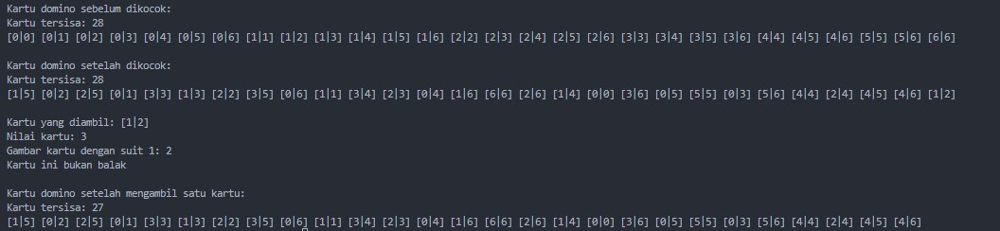
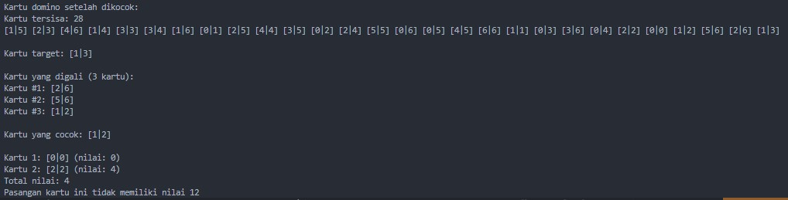
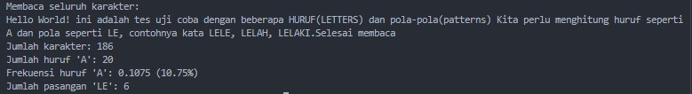

# <h1 align="center">Laporan Praktikum Modul 18 <br> MESIN ABSTRAK</h1>
<p align="center">Cholid Afiddrus Wijayanto - 103112430012</p>

## Dasar Teori

Mesin abstrak adalah model komputasi yang dibangun di atas mesin yang sudah ada, dengan mendefinisikan tipe data dan operasi dasar seperti pada contoh mesin domino atau mesin karakter. Dengan menggunakan mesin abstrak, kita bisa fokus pada logika program seperti mencocokkan kartu atau membaca karakter, tanpa perlu memikirkan cara kerja detail di balik penyimpanan data. Konsep ini mempermudah pemula dalam memahami alur program karena hanya menggunakan antarmuka sederhana yang sudah disediakan. Hasilnya, program menjadi lebih terstruktur, mudah dikembangkan, dan efisien.

## Guided
### Soal 1

Implementasi operasi dasar mesin domino sebagai sebuah subprogram: 
a) Buat tipe data kartu domino (Domino) yang menyimpan informasi 
	➢ gambar (suit) kedua sisi kartu 
	➢ nilai kartu ➢ Boolean data yang menyatakan kartu ini balak atau bukan 
	➢ Buat tipe data satu set kartu domino (Dominoes) 
	➢ Array menyimpan 28 kartu Domino 
	➢ Jumlah kartu tersisa dalam array tersebut 
b) prosedur kocokKartu(Dominoes) 
c) fungsi ambilKartu(Dominoes) → Domino 
d) fungsi gambarKartu(Domino,suit int) → int 
e) fungsi nilaiKartu(Domino) → int

```go
package main

import (
    "fmt"
    "math/rand"
    "time"
)
  
// Domino menyimpan data kartu domino
type Domino struct {
    Side1   int  // Gambar sisi pertama (0-6)
    Side2   int  // Gambar sisi kedua (0-6)
    Value   int  // Nilai kartu (jumlah pip kedua sisi)
    IsBalak bool // True jika kartu balak (kedua sisi sama)
}

// Dominoes menyimpan satu set kartu domino
type Dominoes struct {
    Cards      []Domino // Array menyimpan kartu Domino
    CardsCount int      // Jumlah kartu tersisa
}

// InitDominoes menginisialisasi set kartu domino lengkap (28 kartu)
func InitDominoes() Dominoes {
    var dominoes Dominoes
    dominoes.Cards = make([]Domino, 28)
    dominoes.CardsCount = 28

    // Buat semua kombinasi kartu domino (tanpa duplikat)
    index := 0
    for i := 0; i <= 6; i++ {
        for j := i; j <= 6; j++ {
            dominoes.Cards[index] = Domino{
                Side1:   i,
                Side2:   j,
                Value:   i + j,
                IsBalak: i == j,
            }
            index++
        }
    }
    return dominoes
}

// kocokKartu mengocok/mengacak kartu dalam set
func kocokKartu(d *Dominoes) {
    rand.Seed(time.Now().UnixNano())

    for i := d.CardsCount - 1; i > 0; i-- {
        j := rand.Intn(i + 1)
        d.Cards[i], d.Cards[j] = d.Cards[j], d.Cards[i]
    }
}

// ambilKartu mengambil kartu teratas dari tumpukan
func ambilKartu(d *Dominoes) (Domino, error) {
    if d.CardsCount <= 0 {
        return Domino{}, fmt.Errorf("tidak ada kartu tersisa")
    }

    // Ambil kartu teratas
    card := d.Cards[d.CardsCount-1]
    d.CardsCount--

    return card, nil
}

// gambarKartu mengembalikan gambar sisi lain dari kartu jika sisi yang diminta diberikan
func gambarKartu(d Domino, suit int) int {
    if d.Side1 == suit {
        return d.Side2
    } else if d.Side2 == suit {
        return d.Side1
    }
    return -1 // Jika suit tidak ada di kartu
}

// nilaiKartu mengembalikan nilai kartu (jumlah pip)
func nilaiKartu(d Domino) int {
    return d.Value
}

// PrintDomino mencetak kartu domino dalam format [Side1|Side2]
func PrintDomino(d Domino) {
    fmt.Printf("[%d|%d]", d.Side1, d.Side2)
}

// PrintDominoes mencetak semua kartu
func PrintDominoes(d Dominoes) {
    fmt.Printf("Kartu tersisa: %d\n", d.CardsCount)
    for i := 0; i < d.CardsCount; i++ {
        PrintDomino(d.Cards[i])
        fmt.Print(" ")
    }
    fmt.Println()
}

func main() {
    // Inisialisasi kartu domino
    dominoes := InitDominoes()
    
    fmt.Println("Kartu domino sebelum dikocok:")
    PrintDominoes(dominoes)

    // Kocok kartu
    kocokKartu(&dominoes)

    fmt.Println("\nKartu domino setelah dikocok:")
    PrintDominoes(dominoes)

  

    // Ambil kartu
    card, err := ambilKartu(&dominoes)
    if err != nil {
        fmt.Println("Error:", err)
    } else {
        fmt.Print("\nKartu yang diambil: ")
        PrintDomino(card)

        fmt.Printf("\nNilai kartu: %d\n", nilaiKartu(card))

        suit := card.Side1

        fmt.Printf("Gambar kartu dengan suit %d: %d\n", suit, gambarKartu(card, suit))

        if card.IsBalak {
            fmt.Println("Kartu ini adalah balak")
        } else {
            fmt.Println("Kartu ini bukan balak")
        }
    }

    fmt.Println("\nKartu domino setelah mengambil satu kartu:")
    PrintDominoes(dominoes)
}
```

**Output:**



Program tersebut merupakan implementasi dari mesin abstrak untuk kartu domino. Program ini mendefinisikan struktur data untuk kartu domino dengan dua sisi (Side1 dan Side2), nilai total (Value), dan penanda apakah kartu tersebut balak (IsBalak). Struktur Dominoes menyimpan array kartu dan jumlah kartu yang tersisa. Program ini mengimplementasikan operasi dasar mesin domino seperti kocokKartu yang menggunakan algoritma Fisher-Yates untuk mengacak urutan kartu, ambilKartu untuk mengambil kartu teratas dari tumpukan, gambarKartu untuk mendapatkan sisi lain dari kartu jika satu sisi diberikan, dan nilaiKartu untuk mendapatkan nilai total dari kartu. Fungsi InitDominoes membuat set lengkap 28 kartu domino dengan semua kombinasi valid dari 0-6 pip pada kedua sisi, tanpa duplikasi. Kesimpulannya, program ini menyediakan dasar untuk simulasi permainan kartu domino dengan mendefinisikan struktur data dan operasi dasar yang diperlukan untuk memanipulasi kartu tersebut.


### Soal 2

Realisasi aksi berikut menggunakan operasi-operasi dasar mesin domino: 
a) prosedur galiKartu(Dominoes,Domino) yang mengambil kartu dari tumpukan sampai diperoleh kartu dengan gambar (suit) yang sama dengan kartu yang diberikan.
b) fungsi sepasangKartu(Domino,Domino) → boolean; yang memberikan nilai true jika total nilai kartu adalah 12 dan false jika tidak.

```go
package main

import (
    "fmt"
    "math/rand"
    "time"
) 

// Domino menyimpan data kartu domino
type Domino struct {
    Side1   int  // Gambar sisi pertama (0-6)
    Side2   int  // Gambar sisi kedua (0-6)
    Value   int  // Nilai kartu (jumlah pip kedua sisi)
    IsBalak bool // True jika kartu balak (kedua sisi sama)
}

// Dominoes menyimpan satu set kartu domino
type Dominoes struct {
    Cards      []Domino // Array menyimpan kartu Domino
    CardsCount int      // Jumlah kartu tersisa
}

// InitDominoes menginisialisasi set kartu domino lengkap (28 kartu)
func InitDominoes() Dominoes {
    var dominoes Dominoes
    dominoes.Cards = make([]Domino, 28)
    dominoes.CardsCount = 28
  
    // Buat semua kombinasi kartu domino (tanpa duplikat)
    index := 0
    for i := 0; i <= 6; i++ {
        for j := i; j <= 6; j++ {
            dominoes.Cards[index] = Domino{
                Side1:   i,
                Side2:   j,
                Value:   i + j,
                IsBalak: i == j,
            }
            index++
        }
    }
    return dominoes
}
  
// kocokKartu mengocok/mengacak kartu dalam set
func kocokKartu(d *Dominoes) {
    rand.Seed(time.Now().UnixNano())

    // Fisher-Yates shuffle algorithm
    for i := d.CardsCount - 1; i > 0; i-- {
        j := rand.Intn(i + 1)
        d.Cards[i], d.Cards[j] = d.Cards[j], d.Cards[i]
    }
}

// ambilKartu mengambil kartu teratas dari tumpukan
func ambilKartu(d *Dominoes) (Domino, error) {
    if d.CardsCount <= 0 {
        return Domino{}, fmt.Errorf("tidak ada kartu tersisa")
    }

    // Ambil kartu teratas
    card := d.Cards[d.CardsCount-1]
    d.CardsCount--

    return card, nil
}

// gambarKartu mengembalikan gambar sisi lain dari kartu jika sisi yang diminta diberikan
func gambarKartu(d Domino, suit int) int {
    if d.Side1 == suit {
        return d.Side2
    } else if d.Side2 == suit {
        return d.Side1
    }
    return -1 // Jika suit tidak ada di kartu
}

// nilaiKartu mengembalikan nilai kartu (jumlah pip)
func nilaiKartu(d Domino) int {
    return d.Value
}

// PrintDomino mencetak kartu domino dalam format [Side1|Side2]
func PrintDomino(d Domino) {
    fmt.Printf("[%d|%d]", d.Side1, d.Side2)
}

// PrintDominoes mencetak semua kartu dalam set kartu
func PrintDominoes(d Dominoes) {
    fmt.Printf("Kartu tersisa: %d\n", d.CardsCount)
    for i := 0; i < d.CardsCount; i++ {
        PrintDomino(d.Cards[i])
        fmt.Print(" ")
    }
    fmt.Println()
}

// a) galiKartu mengambil kartu dari tumpukan sampai diperoleh kartu dengan suit yang sama
func galiKartu(d *Dominoes, targetCard Domino) ([]Domino, Domino, error) {
    var drawnCards []Domino
    var matchedCard Domino
    found := false

    for !found && d.CardsCount > 0 {
        card, err := ambilKartu(d)
        if err != nil {
            return drawnCards, Domino{}, err
        }
        
        drawnCards = append(drawnCards, card)

        // Cek apakah kartu yang diambil memiliki suit yang sama dengan target
        if card.Side1 == targetCard.Side1 || card.Side1 == targetCard.Side2 ||
            card.Side2 == targetCard.Side1 || card.Side2 == targetCard.Side2 {
            matchedCard = card
            found = true
        }
    }
  
    if !found {
        return drawnCards, Domino{}, fmt.Errorf("tidak ditemukan kartu dengan suit yang sama")
    }
    return drawnCards, matchedCard, nil
}

// b) sepasangKartu memeriksa apakah pasangan kartu memiliki jumlah nilai 12
func sepasangKartu(card1 Domino, card2 Domino) bool {
    totalValue := nilaiKartu(card1) + nilaiKartu(card2)
    return totalValue == 12
}

func main() {
    // Inisialisasi kartu domino
    dominoes := InitDominoes()

    // Kocok kartu
    kocokKartu(&dominoes)

    fmt.Println("Kartu domino setelah dikocok:")
    PrintDominoes(dominoes)
  
    // Test galiKartu
    targetCard, _ := ambilKartu(&dominoes) // Ambil satu kartu sebagai target
    fmt.Print("\nKartu target: ")
    PrintDomino(targetCard)
    fmt.Println()

    drawnCards, matchedCard, err := galiKartu(&dominoes, targetCard)
    if err != nil {
        fmt.Println("Error:", err)
    } else {
        fmt.Printf("\nKartu yang digali (%d kartu):\n", len(drawnCards))
        for i, card := range drawnCards {
            fmt.Printf("Kartu #%d: ", i+1)
            PrintDomino(card)
            fmt.Println()
        }

        fmt.Print("\nKartu yang cocok: ")
        PrintDomino(matchedCard)
        fmt.Println()
    }

    // Test sepasangKartu
    card1, _ := ambilKartu(&dominoes)
    card2, _ := ambilKartu(&dominoes)

    fmt.Print("\nKartu 1: ")
    PrintDomino(card1)
    fmt.Printf(" (nilai: %d)\n", nilaiKartu(card1))

    fmt.Print("Kartu 2: ")
    PrintDomino(card2)
    fmt.Printf(" (nilai: %d)\n", nilaiKartu(card2))

    totalValue := nilaiKartu(card1) + nilaiKartu(card2)
    fmt.Printf("Total nilai: %d\n", totalValue)

    if sepasangKartu(card1, card2) {
        fmt.Println("Pasangan kartu ini memiliki nilai 12")
    } else {
        fmt.Println("Pasangan kartu ini tidak memiliki nilai 12")
    }
}
```

**Output:**



Program kedua merupakan pengembangan dari mesin abstrak domino dengan menambahkan implementasi aksi pada mesin tersebut. Program ini mendefinisikan dua fungsi utama: galiKartu dan sepasangKartu. Fungsi galiKartu mengambil kartu dari tumpukan secara berulang hingga menemukan kartu dengan gambar (suit) yang sama dengan kartu target yang diberikan, lalu mengembalikan semua kartu yang telah diambil beserta kartu yang cocok. Fungsi sepasangKartu memeriksa apakah dua kartu domino memiliki jumlah nilai tepat 12 dengan memanfaatkan fungsi nilaiKartu. Program ini menggunakan operasi dasar yang telah didefinisikan sebelumnya (kocokKartu, ambilKartu, nilaiKartu) untuk mengimplementasikan fungsionalitas yang lebih kompleks sesuai dengan kebutuhan permainan domino. Dalam fungsi main, program mendemonstrasikan penggunaan kedua fungsi tersebut dengan mengambil kartu target, mencari kartu dengan suit yang sama menggunakan galiKartu, dan memeriksa pasangan kartu menggunakan sepasangKartu. Kesimpulannya, program ini menunjukkan bagaimana operasi-operasi dasar dapat dikomposisikan untuk membuat fungsionalitas yang lebih kompleks dalam konteks mesin abstrak domino.


### Soal 3

Implementasi salah satu permainan domino. Lihat lampiran untuk deskripsi permainan Gapleh.

```go
package main

import (
    "fmt"
    "math/rand"
    "time"
)  

// Domino menyimpan informasi kartu domino
type Domino struct {
    Side1   int  // Gambar sisi pertama (0-6)
    Side2   int  // Gambar sisi kedua (0-6)
    Value   int  // Nilai kartu (jumlah pip kedua sisi)
    IsBalak bool // True jika kartu balak (kedua sisi sama)
}

// Dominoes menyimpan satu set kartu domino
type Dominoes struct {
    Cards      []Domino // Array menyimpan kartu Domino
    CardsCount int      // Jumlah kartu tersisa
}

// Player menyimpan informasi pemain
type Player struct {
    Name  string
    Cards []Domino
}

// GameState menyimpan status permainan
type GameState struct {
    Players      []Player
    DeckCards    Dominoes
    TableCards   []Domino
    CurrentTurn  int
    IsGameOver   bool
    WinnerPlayer int
} 

// InitDominoes menginisialisasi set kartu domino lengkap (28 kartu)
func InitDominoes() Dominoes {
    var dominoes Dominoes
    dominoes.Cards = make([]Domino, 28)
    dominoes.CardsCount = 28

    // Buat semua kombinasi kartu domino (tanpa duplikat)
    index := 0
    for i := 0; i <= 6; i++ {
        for j := i; j <= 6; j++ {
            dominoes.Cards[index] = Domino{
                Side1:   i,
                Side2:   j,
                Value:   i + j,
                IsBalak: i == j,
            }
            index++
        }
    }
    return dominoes
}

// kocokKartu mengocok/mengacak kartu dalam set
func kocokKartu(d *Dominoes) {
    rand.Seed(time.Now().UnixNano())

    // Fisher-Yates shuffle algorithm
    for i := d.CardsCount - 1; i > 0; i-- {
        j := rand.Intn(i + 1)
        d.Cards[i], d.Cards[j] = d.Cards[j], d.Cards[i]
    }
}
  
// ambilKartu mengambil kartu teratas dari tumpukan
func ambilKartu(d *Dominoes) (Domino, error) {
    if d.CardsCount <= 0 {
        return Domino{}, fmt.Errorf("tidak ada kartu tersisa")
    }

    // Ambil kartu teratas
    card := d.Cards[d.CardsCount-1]
    d.CardsCount--
    
    return card, nil
} 

// gambarKartu mengembalikan gambar sisi lain dari kartu jika sisi yang diminta diberikan
func gambarKartu(d Domino, suit int) int {
    if d.Side1 == suit {
        return d.Side2
    } else if d.Side2 == suit {
        return d.Side1
    }
    return -1 // Jika suit tidak ada di kartu
} 

// nilaiKartu mengembalikan nilai kartu (jumlah pip)
func nilaiKartu(d Domino) int {
    return d.Value
} 

// PrintDomino mencetak kartu domino dalam format [Side1|Side2]
func PrintDomino(d Domino) {
    fmt.Printf("[%d|%d]", d.Side1, d.Side2)
} 

// InitGame menginisialisasi permainan Gapleh
func InitGame(playerNames []string) GameState {
    // Inisialisasi kartu
    deckCards := InitDominoes()
    kocokKartu(&deckCards)
    
    // Inisialisasi pemain
    players := make([]Player, len(playerNames))
    for i := range players {
        players[i].Name = playerNames[i]
        players[i].Cards = make([]Domino, 0)

        // Bagikan 7 kartu ke setiap pemain
        for j := 0; j < 7; j++ {
            card, _ := ambilKartu(&deckCards)
            players[i].Cards = append(players[i].Cards, card)
        }
    }
    
    // Cari pemain dengan kartu balak paling tinggi
    highestBalak := -1
    startingPlayer := 0

    for i, player := range players {
        for _, card := range player.Cards {
            if card.IsBalak && card.Value > highestBalak {
                highestBalak = card.Value
                startingPlayer = i
            }
        }
    }

    // Inisialisasi status permainan
    gameState := GameState{
        Players:     players,
        DeckCards:   deckCards,
        TableCards:  make([]Domino, 0),
        CurrentTurn: startingPlayer,
        IsGameOver:  false,
    }
    return gameState
}
  
// CanPlaceCard memeriksa apakah kartu dapat ditempatkan di meja
func CanPlaceCard(card Domino, tableCards []Domino) (bool, int) {
    if len(tableCards) == 0 {
        // Kartu pertama dapat diletakkan
        return true, -1
    }
    // Cek apakah kartu dapat diletakkan di salah satu ujung rantai
    // Ujung pertama (kiri)
    leftEnd := tableCards[0].Side1
    if card.Side1 == leftEnd || card.Side2 == leftEnd {
        return true, 0 // Dapat diletakkan di ujung kiri
    }

    // Ujung akhir (kanan)
    rightEnd := tableCards[len(tableCards)-1].Side2
    if card.Side1 == rightEnd || card.Side2 == rightEnd {
        return true, 1 // Dapat diletakkan di ujung kanan
    }
    return false, -1
}

// PlaceCard menempatkan kartu di meja
func PlaceCard(card Domino, tableCards *[]Domino, position int) {
    if len(*tableCards) == 0 {
        // Kartu pertama diletakkan
        *tableCards = append(*tableCards, card)
        return
    }
    if position == 0 {
        // Ujung kiri
        leftEnd := (*tableCards)[0].Side1
        
        // Orientasi kartu yang benar agar sesuai dengan ujung kiri
        if card.Side2 == leftEnd {
            // Balik kartu agar Side1 sesuai dengan ujung kiri
            card.Side1, card.Side2 = card.Side2, card.Side1
        }  

        // Tambahkan di awal
        *tableCards = append([]Domino{card}, *tableCards...)
    } else {
        // Ujung kanan
        rightEnd := (*tableCards)[len(*tableCards)-1].Side2

        // Orientasi kartu yang benar agar sesuai dengan ujung kanan
        if card.Side1 == rightEnd {
            // Kartu sudah berorientasi dengan benar
        } else {
            // Balik kartu agar Side1 sesuai dengan ujung kanan
            card.Side1, card.Side2 = card.Side2, card.Side1
        }
  
        // Tambahkan di akhir
        *tableCards = append(*tableCards, card)
    }
}
 
// IsWinner memeriksa apakah pemain telah menang
func IsWinner(player Player) bool {
    return len(player.Cards) == 0
} 

// PlayTurn melakukan giliran bermain untuk pemain tertentu
func PlayTurn(gameState *GameState) {
    player := gameState.Players[gameState.CurrentTurn]
    fmt.Printf("\n--- Giliran %s ---\n", player.Name)
    fmt.Printf("Kartu %s: ", player.Name)
    
    for i, card := range player.Cards {
        fmt.Printf("#%d ", i+1)
        PrintDomino(card)
        fmt.Print(" ")
    }
    fmt.Println()

    // Tampilkan kartu di meja
    fmt.Print("Kartu di meja: ")
    
    if len(gameState.TableCards) == 0 {
        fmt.Println("[Kosong]")
    } else {
        for _, card := range gameState.TableCards {
            PrintDomino(card)
            fmt.Print(" ")
        }
        fmt.Println()
    }

    // Cari kartu yang dapat dimainkan
    var playableCards []int
    for i, card := range player.Cards {
        canPlace, _ := CanPlaceCard(card, gameState.TableCards)
        if canPlace {
            playableCards = append(playableCards, i)
        }
    }
    
    if len(playableCards) > 0 {
        // Pilih kartu untuk dimainkan (secara otomatis dalam simulasi ini)
        chosenCardIndex := playableCards[0]
        chosenCard := player.Cards[chosenCardIndex]

        fmt.Printf("%s memainkan kartu: ", player.Name)
        PrintDomino(chosenCard)
        fmt.Println()

        // Tentukan di mana meletakkan kartu
        _, position := CanPlaceCard(chosenCard, gameState.TableCards)

        // Letakkan kartu di meja
        PlaceCard(chosenCard, &gameState.TableCards, position)

        // Hapus kartu dari tangan pemain
        player.Cards = append(player.Cards[:chosenCardIndex], player.Cards[chosenCardIndex+1:]...)

        gameState.Players[gameState.CurrentTurn] = player

        // Cek apakah pemain menang
        if IsWinner(player) {
            gameState.IsGameOver = true
            gameState.WinnerPlayer = gameState.CurrentTurn
            return
        }
    } else {
        // Jika tidak ada kartu yang dapat dimainkan, ambil dari deck
        fmt.Printf("%s tidak memiliki kartu yang dapat dimainkan\n", player.Name)
  
        if gameState.DeckCards.CardsCount > 0 {
            newCard, _ := ambilKartu(&gameState.DeckCards)
            
            fmt.Printf("%s mengambil kartu: ", player.Name)
            PrintDomino(newCard)
            fmt.Println()
  
            // Cek apakah kartu baru dapat dimainkan
            canPlace, position := CanPlaceCard(newCard, gameState.TableCards)
            if canPlace {
                fmt.Printf("%s memainkan kartu yang diambil\n", player.Name)

                // Letakkan kartu di meja
                PlaceCard(newCard, &gameState.TableCards, position)
            } else {
                // Tambahkan ke tangan pemain
                player.Cards = append(player.Cards, newCard)
                gameState.Players[gameState.CurrentTurn] = player
            }
        } else {
            fmt.Println("Tidak ada kartu tersisa di deck")
        }
    }

    // Giliran berikutnya
    gameState.CurrentTurn = (gameState.CurrentTurn + 1) % len(gameState.Players)
}
  
// SimulateGame mensimulasikan permainan Gapleh
func SimulateGame(playerNames []string) {
    gameState := InitGame(playerNames)
    
    fmt.Println("=== PERMAINAN GAPLEH DIMULAI ===")
    maxTurns := 100 // Batasi jumlah giliran untuk menghindari loop tak terhingga
    turnCount := 0

    for !gameState.IsGameOver && turnCount < maxTurns {
        PlayTurn(&gameState)
        turnCount++
    }
    
    if gameState.IsGameOver {
        fmt.Printf("\n=== PERMAINAN BERAKHIR ===\n")
        fmt.Printf("Pemenang: %s\n", gameState.Players[gameState.WinnerPlayer].Name)
    } else {
        fmt.Printf("\n=== PERMAINAN BERAKHIR (JUMLAH GILIRAN MAKSIMUM) ===\n")

        // Cari pemain dengan jumlah kartu paling sedikit
        minCards := 999
        winnerIndex := -1

        for i, player := range gameState.Players {
            if len(player.Cards) < minCards {
                minCards = len(player.Cards)
                winnerIndex = i
            }
        }
        fmt.Printf("Pemenang (jumlah kartu paling sedikit): %s\n", gameState.Players[winnerIndex].Name)
    }
}

func main() {
    // Simulasikan permainan Gapleh dengan 2 pemain
    playerNames := []string{"Pemain 1", "Pemain 2"}
    SimulateGame(playerNames)
}
```

**Output:**

.jpg)
.jpg)
.jpg)
**dan seterusnya, karena batas turn sampai 100 maka terlalu panjang outputnya jika discreenshot semua ** .
.jpg)

Program ini merupakan implementasi permainan domino Gapleh menggunakan mesin abstrak domino yang telah dibuat sebelumnya. Program mendefinisikan struktur data tambahan untuk Player (pemain) yang menyimpan nama dan kartu-kartu yang dipegang, serta GameState yang menyimpan informasi keseluruhan permainan seperti pemain, kartu di deck, kartu di meja, giliran saat ini, dan status permainan. Fungsi InitGame menginisialisasi permainan dengan mengocok kartu, membagikan 7 kartu ke setiap pemain, dan menentukan pemain pertama berdasarkan kepemilikan kartu balak tertinggi. Fungsi CanPlaceCard memeriksa apakah kartu dapat ditempatkan di meja dengan menyesuaikan aturan Gapleh, sementara PlaceCard menempatkan kartu di lokasi yang sesuai dengan mempertimbangkan orientasi kartu. Program menggunakan fungsi PlayTurn untuk menjalankan giliran setiap pemain secara berurutan, di mana pemain dapat memainkan kartu yang cocok atau mengambil kartu baru jika tidak memiliki kartu yang dapat dimainkan. Fungsi SimulateGame mensimulasikan jalannya permainan Gapleh dari awal hingga akhir, dengan permainan berakhir saat seorang pemain menghabiskan semua kartunya atau jumlah giliran maksimum tercapai. Kesimpulannya, program ini menunjukkan bagaimana mesin abstrak domino dapat digunakan untuk membangun permainan yang kompleks dengan mendefinisikan aturan spesifik dan alur permainan yang jelas.

### Soal 4

Implementasi mesin abstrak karakter yang bekerja terhadap untaian karakter (yang diakhiri dengan penanda titik (".") dan mempunyai sejumlah operasi dasar. 
a) Operasi dasar mesin karakter: 
	➢ Prosedur start(); yang menyiapkan mesin karakter di awal rangkaian karakter. 
	➢ Prosedur maju(); yang memajukan pembaca ke posisi karakter berikutnya. 
	➢ Fungsi eop(); yang mengembalikan nilai true apabila sudah mencapai akhir rangkaian, sampai ke penanda titik ("."). 
	➢ Fungsi cc(); yang mengembalikan karakter yang sedang terbaca, atau berada pada posisi pembacaan mesin. 
	
b) Dengan operasi dasar di atas buat algoritma untuk: 
➢ Membaca seluruh karakter yang diberikan ke mesin karakter tersebut. 
➢ Menghitung berapa banyak karakter yang terbaca. 
➢ Menghitung ada berapa huruf "A" yang terbaca. 
➢ Menghitung frekuensi kemunculan huruf "A" terhadap seluruh karakter terbaca. 
➢ Menghitung ada berapa kata "LE" (pasangan berturutan huruf "L" dan "E") yang terbaca.

```go
package main

import (
    "fmt"
)

// CharMachine adalah implementasi mesin abstrak karakter
type CharMachine struct {
    Content     string // Untaian karakter yang akan dibaca
    CurrentChar byte   // Karakter yang sedang dibaca
    CurrentPos  int    // Posisi pembacaan saat ini
    IsEOP       bool   // End of processing (true jika sudah mencapai akhir)
}

// NewCharMachine membuat instansi mesin karakter baru
func NewCharMachine(content string) *CharMachine {
    return &CharMachine{
        Content:     content,
        CurrentChar: 0,
        CurrentPos:  0,
        IsEOP:       false,
    }
}

// start menyiapkan mesin karakter di awal rangkaian karakter
func (m *CharMachine) start() {
    m.CurrentPos = 0
    m.IsEOP = false

    // Jika konten tidak kosong, baca karakter pertama
    if len(m.Content) > 0 {
        m.CurrentChar = m.Content[0]
    } else {
        m.IsEOP = true
    }
} 

// maju memajukan pembaca ke posisi karakter berikutnya
func (m *CharMachine) maju() {
    // Tambah posisi
    m.CurrentPos++

    // Cek apakah sudah mencapai akhir untaian atau menemui titik
    if m.CurrentPos >= len(m.Content) || m.Content[m.CurrentPos-1] == '.' {
        m.IsEOP = true
    } else {
        // Baca karakter berikutnya
        m.CurrentChar = m.Content[m.CurrentPos]
    }
} 

// eop mengembalikan nilai true apabila sudah mencapai akhir rangkaian
func (m *CharMachine) eop() bool {
    return m.IsEOP
} 

// cc mengembalikan karakter yang sedang terbaca
func (m *CharMachine) cc() byte {
    return m.CurrentChar
}

// ReadAllChars membaca seluruh karakter yang diberikan ke mesin karakter
func ReadAllChars(m *CharMachine) {
    fmt.Println("Membaca seluruh karakter:")

    m.start()
    
    for !m.eop() {
        fmt.Printf("%c", m.cc())
        m.maju()
    }
    fmt.Println("\nSelesai membaca")
}
 
// CountChars menghitung berapa banyak karakter yang terbaca
func CountChars(m *CharMachine) int {
    count := 0
    
    m.start()
  
    for !m.eop() {
        count++
        m.maju()
    }
    return count
}
 
// CountA menghitung berapa banyak huruf "A" yang terbaca
func CountA(m *CharMachine) int {
    count := 0
    
    m.start()

    for !m.eop() {
        if m.cc() == 'A' || m.cc() == 'a' {
            count++
        }
        m.maju()
    }
    return count
}
 
// FrequencyA menghitung frekuensi kemunculan huruf "A" terhadap seluruh karakter terbaca
func FrequencyA(m *CharMachine) float64 {
    totalChars := CountChars(m)
    totalA := CountA(m)

    if totalChars == 0 {
        return 0.0
    }
    return float64(totalA) / float64(totalChars)
}
 
// CountLE menghitung ada berapa kata "LE" (pasangan berturutan huruf "L" dan "E") yang terbaca
func CountLE(m *CharMachine) int {
    count := 0

    m.start()

    // Untuk mendeteksi "LE", kita perlu menyimpan karakter sebelumnya
    var prevChar byte

    for !m.eop() {
        currChar := m.cc()

        // Cek apakah kita menemukan pasangan "L" dan "E"
        if (prevChar == 'L' || prevChar == 'l') && (currChar == 'E' || currChar == 'e') {
            count++
        }
        prevChar = currChar
        
        m.maju()
    }
    return count
}
 
func main() {
    // Contoh penggunaan mesin karakter
    inputString := "Hello World! ini adalah tes uji coba dengan beberapa HURUF(LETTERS) dan pola-pola(patterns) Kita perlu menghitung huruf seperti A dan pola seperti LE, contohnya kata LELE, LELAH, LELAKI."
  
    // Buat mesin karakter
    charMachine := NewCharMachine(inputString)
  
    // 1. Membaca seluruh karakter
    ReadAllChars(charMachine)

    // 2. Menghitung berapa banyak karakter yang terbaca
    totalChars := CountChars(charMachine)
    fmt.Printf("Jumlah karakter: %d\n", totalChars)
  
    // 3. Menghitung ada berapa huruf "A" yang terbaca
    totalA := CountA(charMachine)
    fmt.Printf("Jumlah huruf 'A': %d\n", totalA)
  
    // 4. Menghitung frekuensi kemunculan huruf "A" terhadap seluruh karakter terbaca
    freqA := FrequencyA(charMachine)
    fmt.Printf("Frekuensi huruf 'A': %.4f (%.2f%%)\n", freqA, freqA*100)

    // 5. Menghitung ada berapa kata "LE" (pasangan berturutan huruf "L" dan "E") yang terbaca
    totalLE := CountLE(charMachine)
    fmt.Printf("Jumlah pasangan 'LE': %d\n", totalLE)
}
```

**Output:**



Program ini merupakan implementasi mesin abstrak karakter yang bekerja terhadap untaian karakter yang diakhiri dengan tanda titik. Program mendefinisikan struktur CharMachine yang menyimpan untaian karakter, karakter yang sedang dibaca, posisi pembacaan saat ini, dan status akhir pembacaan. Terdapat empat operasi dasar: start() untuk menyiapkan mesin di awal rangkaian karakter, maju() untuk memajukan pembaca ke posisi berikutnya, eop() untuk mengecek apakah sudah mencapai akhir rangkaian, dan cc() untuk mendapatkan karakter yang sedang terbaca. Dengan menggunakan operasi dasar tersebut, program mengimplementasikan fungsi-fungsi yang lebih kompleks seperti ReadAllChars untuk membaca dan menampilkan seluruh karakter, CountChars untuk menghitung jumlah karakter, CountA untuk menghitung jumlah huruf "A", CountAFrequency untuk menghitung frekuensi kemunculan huruf "A", dan CountLE untuk menghitung kemunculan pasangan berturutan huruf "L" dan "E". Dalam fungsi main, program mendemonstrasikan penggunaan semua fungsi tersebut dengan menganalisis teks contoh. Kesimpulannya, program ini menunjukkan bagaimana mesin abstrak dapat digunakan untuk menganalisis karakteristik teks dengan membangun operasi-operasi kompleks di atas operasi-operasi dasar, membuktikan konsep abstraksi dan komposisi dalam pemrograman.

