<h1 align="center">Laporan Praktikum Modul 2 REVIEW PENGENALAN PEMROGRAMAN</h1> <p align="center">Cholid Afiddrus Wijayanto - 103112430012</p>
## Dasar Teori


<div style="text-align: justify;">
ngga usah panjang panjang kalau bisa satu paragfraf aja
</div>

## Unguided

### Soal 1

<div style="text-align: justify;">
Telusuri program berikut dengan cara mengkompilasi dan mengeksekusi program. Silakan masukan data yang sesuai sebanyak yang diminta program. Perhatikan keluaran yang diperoleh. Coba terangkan apa sebenarnya yang dilakukan program tersebut?
</div>

```go
package main
import "fmt"

func main() {

    var satu, dua, tiga string
    var temp string

    fmt.Print("Masukkan input string: ")
    fmt.Scanln(&satu)

    fmt.Print("Masukkan input string: ")
    fmt.Scanln(&dua)

    fmt.Print("Masukkan input string: ")
    fmt.Scanln(&tiga)

    fmt.Println("Output awal =", satu, dua, tiga)
    
    temp = satu
    satu = dua
    dua = tiga
    tiga = temp
    
    fmt.Println("Output akhir =", satu, dua, tiga)
}
```

> Output
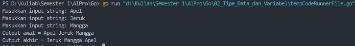`


<div style="text-align: justify;">
Program ini melakukan pertukaran nilai dari tiga variabel string.

Fungsi utama program adalah untuk mendemonstrasikan konsep pertukaran nilai dalam pemrograman, yang sering digunakan dalam algoritma pengurutan dan manipulasi data.
</div>

Dengan alur:

1. Program meminta user untuk memasukkan tiga buah string.

2. Kemudian, program menukar posisi dari ketiga string tersebut dan menampilkan hasil akhir setelah pertukaran.


### Soal 2

<div style="text-align: justify;">
Tahun kabisat adalah tahun yang habis dibagi 400 atau habis dibagi 4 tetapi tidak habis dibagi 100. Buatlah sebuah program yang menerima input sebuah bilangan bulat dan memeriksa apakah bilangan tersebut merupakan tahun kabisat (true) atau bukan (false).
</div>

```go
package main

import (
    "fmt"
)

func main() {

    var tahun int
    fmt.Print("Tahun: ")
    fmt.Scanln(&tahun)
   
    kabisat := false
    if tahun%400 == 0 || (tahun%4 == 0 && tahun%100 != 0) {
        kabisat = true
    }
    
    fmt.Printf("Kabisat: %t\n", kabisat)
}
```

> Output
> 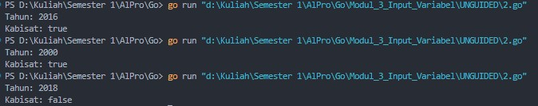

<div style="text-align: justify;">Program ini memeriksa apakah suatu tahun merupakan tahun kabisat. Tahun kabisat yaitu tahun yang habis dibagi 400 atau habis dibagi 4 tetapi tidak habis dibagi 100. Program menerima input berupa bilangan bulat yang mewakili tahun, kemudian menggunakan logika kondisi (if) untuk menentukan apakah tahun tersebut memenuhi syarat sebagai tahun kabisat. Hasil akhirnya ditampilkan dalam format boolean (`true` atau `false`) untuk menunjukkan apakah tahun yang dimasukkan adalah tahun kabisat atau bukan.</div>


### Soal 3

Buat program Bola yang menerima input jari-jari suatu bola (bilangan bulat). Tampilkan Volume dan Luas kulit bola. 𝑣𝑜𝑙𝑢𝑚𝑒𝑏𝑜𝑙𝑎 = 4 / 3 𝜋𝑟^3 dan 𝑙𝑢𝑎𝑠𝑏𝑜𝑙𝑎 = 4𝜋𝑟^2 (π ≈ 3.1415926535).

```go
package main

import "fmt"

func main() {

    const pi = 3.1415926535
    
    var r float64
    fmt.Print("Jejari = ")
    fmt.Scanln(&r)
    
    volume := (4.0 / 3.0) * pi * r * r * r
    
    luas := 4 * pi * r * r

    fmt.Printf("Bola dengan jejari %.0f memiliki volume %.4f dan luas kulit %.4f\n", r, volume, luas)
}
```

> Output
> 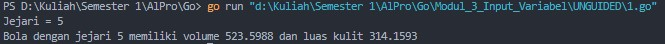

<div style="text-align: justify;">Program ini menghitung volume dan luas permukaan bola berdasarkan jari-jari yang dimasukkan oleh user. Menggunakan konstanta π(phi) ≈ 3.1415926535, program menerapkan rumus volume bola V=4 / 3πr^3  dan luas permukaan bola A = 4πr^2 untuk menghasilkan outputnya. Setelah menerima input jari-jari, program menghitung nilai volume dan luas permukaan, lalu menampilkannya dengan empat angka di belakang koma agar lebih akurat. Program ini menggunakan **operasi aritmatika sederhana** untuk melakukan konversi dan memastikan hasilnya jelas bagi user. </div>


### Soal 4

<div style="text-align: justify;">Dibaca nilai temperatur dalam derajat Celsius. Nyatakan temperatur tersebut dalam Fahrenheit 𝐶𝑒𝑙𝑠𝑖𝑢𝑠 = (𝐹𝑎ℎ𝑟𝑒𝑛ℎ𝑒𝑖𝑡 − 32) × 5 / 9 𝑅𝑒𝑎𝑚𝑢𝑟 = 𝐶𝑒𝑙𝑐𝑖𝑢𝑠 × 4 / 5 𝐾𝑒𝑙𝑣𝑖𝑛 = (𝐹𝑎ℎ𝑟𝑒𝑛ℎ𝑒𝑖𝑡 + 459.67) × 5 / 9</div>

```go
package main

import (
    "fmt"
)

func main() {

    var celsius float64
    fmt.Print("Temperatur Celsius: ")
    fmt.Scanln(&celsius)


    reamur := celsius * 4 / 5


    fahrenheit := (celsius * 9 / 5) + 32


    kelvin := celsius + 273.15


    fmt.Printf("Derajat Reamur: %.0f\n", reamur)
    fmt.Printf("Derajat Fahrenheit: %.0f\n", fahrenheit)
    fmt.Printf("Derajat Kelvin: %.0f\n", kelvin)
}
```

> Output
> 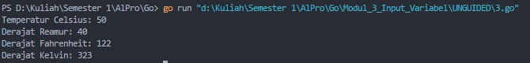

<div style="text-align: justify;">Program ini mengonversi suhu dari Celsius ke suhu lainnya yaitu: Reamur, Fahrenheit, dan Kelvin. Setelah menerima input suhu dalam Celsius dari user, program menghitung nilai dalam skala Reamur menggunakan rumus R = C × 4 / 5, Fahrenheit dengan F = (C × 9 / 5)+32, dan Kelvin dengan K = C + 273.15. Hasil konversi kemudian ditampilkan dalam format tanpa desimal agar mempermudah untuk dibaca.</div>


### Soal 5

<div style="text-align: justify;">Tipe karakter sebenarnya hanya apa yang tampak dalam tampilan. Di dalamnya tersimpan dalam bentuk biner 8 bit (byte) atau 32 bit (rune) saja. Buat program ASCII yang akan membaca 5 buat data integer dan mencetaknya dalam format karakter. Kemudian membaca 3 buah data karakter dan mencetak 3 buah karakter setelah karakter tersebut (menurut tabel ASCII) Masukan terdiri dari dua baris. Baris pertama berisi 5 buah data integer. Data integer mempunyai nilai antara 32 s.d. 127. Baris kedua berisi 3 buah karakter yang berdampingan satu dengan yang lain (tanpa dipisahkan spasi). Keluaran juga terdiri dari dua baris. Baris pertama berisi 5 buah representasi karakter dari data yang diberikan, yang berdampingan satu dengan lain, tanpa dipisahkan spasi. Baris kedua berisi 3 buah karakter (juga tidak dipisahkan oleh spasi). </div>

```go
package main

import "fmt"

func main() {

    var c1, c2, c3, c4, c5 int
    var b1, b2, b3 byte
    fmt.Scan(&c1, &c2, &c3, &c4, &c5)

    var temp string
    fmt.Scanln(&temp)
    
    fmt.Scanf("%c%c%c", &b1, &b2, &b3)
    
    fmt.Printf("%c%c%c%c%c\n", c1, c2, c3, c4, c5)

    fmt.Printf("%c%c%c\n", b1+1, b2+1, b3+1)
}
```

> Output
> 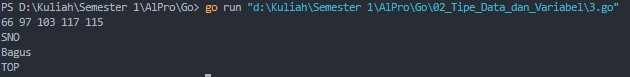

<div style="text-align: justify;">Program ini mengubah angka menjadi huruf sesuai dengan tabel ASCII dan menggeser beberapa huruf ke depan. **Pertama**, program meminta user memasukkan **lima angka** antara **32 hingga 127**. Setiap angka dikonversi ke huruf berdasarkan tabel ASCII dan ditampilkan dalam satu baris tanpa spasi. **Kedua**, program meminta **tiga huruf** sebagai input. Setiap huruf kemudian digeser **satu langkah maju** dalam urutan ASCII (misalnya, 'A' menjadi 'B'). **Terakhir**, program mencetak dua baris output: **baris pertama** berisi lima huruf hasil konversi dari angka, dan **baris kedua** berisi tiga huruf yang sudah digeser. Program ini menggunakan **perulangan** untuk membaca input dan **fungsi bawaan ASCII** untuk melakukan konversi. </div>


### Soal 6

<div style="text-align: justify;">Siswa kelas IPA di salah satu sekolah menengah atas di Indonesia sedang mengadakan praktikum kimia. Di setiap percobaan akan menggunakan 4 tabung reaksi, yang mana susunan warna cairan di setiap tabung akan menentukan hasil percobaan. Siswa diminta untuk mencatat hasil percobaan tersebut. Percobaan dikatakan berhasil apabila susunan warna zat cair pada gelas 1 hingga gelas 4 secara berturutan adalah ‘merah’, ‘kuning’, ‘hijau’, dan ‘ungu’ selama 5 kali percobaan berulang. Buatlah sebuah program yang menerima input berupa warna dari ke 4 gelas reaksi sebanyak 5 kali percobaan. Kemudian program akan menampilkan true apabila urutan warna sesuai dengan informasi yang diberikan pada paragraf sebelumnya, dan false untuk urutan warna lainnya.</div>

```go
package main

import (
    "bufio"
    "fmt"
    "os"
    "strings"
)

type Percobaan struct {
    gelas []string
}

type HasilPraktikum struct {
    percobaan []Percobaan
}

func NewHasilPraktikum() *HasilPraktikum {
    return &HasilPraktikum{
        percobaan: make([]Percobaan, 0),
    }
}

func (h *HasilPraktikum) TambahPercobaan(gelas []string) {
    h.percobaan = append(h.percobaan, Percobaan{gelas: gelas})
}

func (h *HasilPraktikum) CekHasil() bool {
    urutanBenar := []string{"merah", "kuning", "hijau", "ungu"}
  
    var i int
    for i = 0; i < len(h.percobaan); i++ {
        if len(h.percobaan[i].gelas) != 4 {
            return false
        }
        
        var j int
        for j = 0; j < 4; j++ {
            if h.percobaan[i].gelas[j] != urutanBenar[j] {
                return false
            }
        }
    }
    return true
}

func main() {
    hasil := NewHasilPraktikum()
    scanner := bufio.NewScanner(os.Stdin)

    var i int
    for i = 1; i <= 5; i++ {

        fmt.Printf("Percobaan %d: ", i)
        scanner.Scan()
        input := scanner.Text()
        warna := strings.Fields(input)
        hasil.TambahPercobaan(warna)
    }

    fmt.Printf("BERHASIL: %t\n", hasil.CekHasil())
}
```

> Output
> 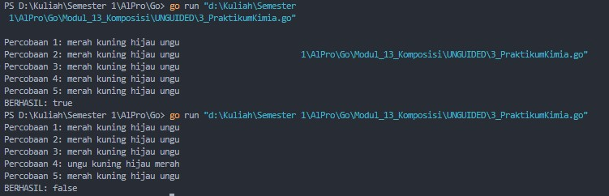

<div style="text-align: justify;">Program ini membantu user mengecek urutan warna dalam percobaan kimia. Urutan yang benar adalah **merah, kuning, hijau, ungu**. Program meminta user memasukkan warna untuk **lima kali percobaan**. Setiap kali user memasukkan warna, program akan membandingkannya dengan urutan yang benar. Jika semua percobaan sesuai, program menampilkan **BERHASIL: true**. Jika ada **satu saja** yang salah, hasilnya **BERHASIL: false**. Program menggunakan **perulangan** untuk meminta input warna dan **kondisi if-else** untuk mengecek apakah semua percobaan benar atau tidak. </div>


### Soal 7

<div style="text-align: justify;">Suatu pita (string) berisi kumpulan nama-nama bunga yang dipisahkan oleh spasi dan ‘– ‘, contoh pita diilustrasikan seperti berikut ini. Pita: mawar – melati – tulip – teratai – kamboja – anggrek Buatlah sebuah program yang menerima input sebuah bilangan bulat positif (dan tidak nol) N, kemudian program akan meminta input berupa nama bunga secara berulang sebanyak N kali dan nama tersebut disimpan ke dalam pita. (Petunjuk: gunakan operasi penggabungan string dengan operator “+” ). Tampilkan isi pita setelah proses input selesai. Modifikasi program sebelumnya, proses input akan berhenti apabila user mengetikkan ‘SELESAI’. Kemudian tampilkan isi pita beserta banyaknya bunga yang ada di dalam pita</div>

```go
package main

import (
    "bufio"
    "fmt"
    "os"
    "strings"
)

type PitaBunga struct {
    isi    string
    jumlah int
}

func NewPitaBunga() *PitaBunga {
    return &PitaBunga{
        isi:    "",
        jumlah: 0,
    }
}

func (p *PitaBunga) TambahBunga(bunga string) {
    if p.isi == "" {
        p.isi = bunga
    } else {
        p.isi += " - " + bunga
    }
    p.jumlah++
}

func InputDenganN() {
    var n int
    fmt.Print("N: ")
    fmt.Scan(&n)

    if n <= 0 {
        fmt.Println("Pita: ")
        return
    }
    
    pita := NewPitaBunga()
    scanner := bufio.NewScanner(os.Stdin)
    
    for i := 1; i <= n; i++ {
        fmt.Printf("Bunga %d: ", i)
        scanner.Scan()
        bunga := scanner.Text()
        bunga = strings.TrimSpace(bunga)

  

        if bunga != "" {
            pita.TambahBunga(bunga)
        }
    }
    fmt.Printf("Pita: %s\n", pita.isi)
}

func InputSampaiSelesai() {
    pita := NewPitaBunga()
    scanner := bufio.NewScanner(os.Stdin)

    i := 1
    for {
        fmt.Printf("Bunga %d: ", i)
        scanner.Scan()
        bunga := scanner.Text()
        bunga = strings.TrimSpace(bunga)

        if bunga == "SELESAI" {
            break
        }

        if bunga != "" {
            pita.TambahBunga(bunga)
            i++
        }
    }
    fmt.Printf("Pita: %s\n", pita.isi)
    fmt.Printf("Bunga: %d\n", pita.jumlah)
}

func main() {
    // InputDenganN()     // Untuk versi dengan input N
    InputSampaiSelesai() // Untuk versi dengan input sampai SELESAI
}
```

> Output
> 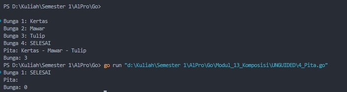

<div style="text-align: justify;">Program ini memungkinkan user menyusun pita berisi nama-nama bunga dengan dua cara: memasukkan sejumlah bunga sesuai angka `N` yang diberikan atau mengetikkan bunga secara berulang hingga memasukkan kata `SELESAI`. Program menyimpan bunga dalam variabel `PitaBunga`, yang menggunakan string dengan format `"bunga1 - bunga2 - bunga3"` untuk menggabungkan nama-nama bunga yang dimasukkan.

Jika user memilih metode pertama, mereka harus memasukkan `N` nama bunga, dan setelahnya program menampilkan pita yang terbentuk. Jika memilih metode kedua, input akan berhenti ketika user mengetik `SELESAI`, dan program akan menampilkan daftar bunga serta jumlahnya.</div>


### Soal 8

<div style="text-align: justify;">Setiap hari Pak Andi membawa banyak barang belanjaan dari pasar dengan mengendarai sepeda motor. Barang belanjaan tersebut dibawa dalam kantong terpal di kiri-kanan motor. Sepeda motor tidak akan oleng jika selisih berat barang di kedua kantong sisi tidak lebih dari 9 kg. Buatlah program Pak Andi yang menerima input dua buah bilangan real positif yang menyatakan berat total masing-masing isi kantong terpal. Program akan terus meminta input bilangan tersebut hingga salah satu kantong terpal berisi 9 kg atau lebih. Pada modifikasi program tersebut, program akan menampilkan true jika selisih kedua isi kantong lebih dari atau sama dengan 9 kg. Program berhenti memproses apabila total berat isi kedua kantong melebihi 150 kg atau salah satu kantong beratnya negatif.</div>

```go
package main

import (
    "fmt"
    "math"
)

func VersiPertama() {
    for {
        var kantongKiri, kantongKanan float64
        fmt.Print("Masukkan berat belanjaan di kedua kantong: ")
        fmt.Scan(&kantongKiri, &kantongKanan)

        if kantongKiri >= 9 || kantongKiri >= 9 {
            fmt.Println("Proses selesai.")
            break
        }
    }
}
  
func VersiKedua() {
    for {
        var kantongKiri, kantongKanan float64
        fmt.Print("Masukkan berat belanjaan di kedua kantong: ")
        fmt.Scan(&kantongKiri, &kantongKanan)

        if kantongKiri < 0 || kantongKanan < 0 {
            fmt.Println("Program selesai.")
            break
        }
        
        totalBerat := kantongKiri + kantongKanan
        if totalBerat >= 150 {
            fmt.Println("Proses selesai.")
            break
        }
        
        selisihBerat := math.Abs(kantongKiri - kantongKanan)
        akanOleng := selisihBerat >= 9
        fmt.Printf("Sepeda motor pak Andi akan oleng: %t\n", akanOleng)
    }
}

func main() {
    /// VersiPertama() Untuk versi pertama
    VersiKedua() // Untuk versi kedua
}
```

> Output
> 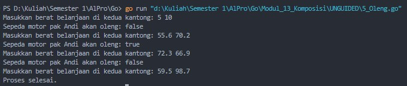

Program ini membantu Pak Andi mengecek apakah motornya akan oleng berdasarkan berat belanjaan di dua kantong terpal.

1. **Versi pertama** meminta user memasukkan berat kantong kiri dan kanan terus-menerus hingga salah satu kantong mencapai **9 kg atau lebih**, lalu program berhenti.
2. **Versi kedua** terus meminta input berat kantong sampai total berat lebih dari **150 kg** atau salah satu kantong bernilai negatif. Program juga menghitung selisih berat kedua kantong. Jika selisihnya **9 kg atau lebih**, motor akan oleng (`true`), jika tidak, motor tetap seimbang (`false`).

Program ini menggunakan perulangan untuk terus menerima input sampai salah satu kondisi berhenti terpenuhi.


### Soal 9

<div style="text-align: justify;">𝑓(𝑘) = (4𝑘 + 2) ^2 / (4𝑘 + 1)(4𝑘 + 3) Buatlah sebuah program yang menerima input sebuah bilangan sebagai K, kemudian menghitung dan menampilkan nilai f(K) sesuai persamaan di atas. √2 merupakan bilangan irasional. Meskipun demikian, nilai tersebut dapat dihampiri dengan rumus berikut: √2 = ∏∞ 𝑘=0 (4𝑘 + 2) ^2 (4𝑘 + 1)(4𝑘 + 3)  Modifikasi program sebelumnya yang menerima input integer 𝐾 dan menghitung √2 untuk 𝐾 tersebut. Hampiran √2 dituliskan dalam ketelitian 10 angka di belakang koma.</div>

```go
package main

import (
    "fmt"
    "math"
)

func main() {
    var k int
    fmt.Print("Nilai K = ")
    fmt.Scan(&k)

    result := 1.0

    for i := 0; i <= k; i++ {
        numerator := math.Pow(float64(4*i+2), 2)
        denominator := float64((4*i + 1) * (4*i + 3))
        result *= numerator / denominator
    }
    
    fmt.Printf("Nilai akar 2 = %.10f\n", result)
}
```

> Output
> 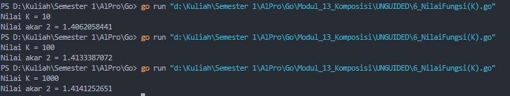

<div style="text-align: justify;">Program ini digunakan untuk memperkirakan nilai **√2** dengan melakukan perhitungan berulang. Pertama, program meminta user memasukkan **nilai K**, yang menentukan seberapa banyak iterasi yang dilakukan agar hasil perhitungan semakin mendekati nilai **√2**. Program memulai dengan **result = 1.0**, yang nantinya akan diperbarui dalam setiap iterasi. Kemudian, program menjalankan **perulangan dari 0 hingga K**, di mana setiap iterasi akan menghitung **pembilang** menggunakan rumus `(4𝑖 + 2)²` dan **penyebut** dengan rumus `(4𝑖 + 1)(4𝑖 + 3)`. Setelah itu, hasil perkalian sebelumnya akan dikalikan dengan **pembilang dibagi penyebut** untuk memperbarui nilai `result`. Setelah semua perhitungan selesai, program menampilkan hasil akhir dengan **10 angka di belakang koma** agar lebih akurat. Semakin besar nilai **K** yang dimasukkan, semakin mendekati hasilnya dengan nilai asli **√2**.</div>


### Soal 10

<div style="text-align: justify;">PT POS membutuhkan aplikasi perhitungan biaya kirim berdasarkan berat parsel. Maka, buatlah program BiayaPos untuk menghitung biaya pengiriman tersebut dengan ketentuan sebagai berikut! Dari berat parsel (dalam gram), harus dihitung total berat dalam kg dan sisanya (dalam gram). Biaya jasa pengiriman adalah Rp. 10.000,- per kg. Jika sisa berat tidak kurang dari 500 gram, maka tambahan biaya kirim hanya Rp. 5,- per gram saja. Tetapi jika kurang dari 500 gram, maka tambahan biaya akan dibebankan sebesar Rp. 15,- per gram. Sisa berat (yang kurang dari 1kg) digratiskan biayanya apabila total berat ternyata lebih dari 10kg.</div>

```go
package main

import "fmt"

func main() {
    var beratParsel int
    fmt.Print("Masukkan berat parsel (gram): ")
    fmt.Scan(&beratParsel)

    // Hitung total berat dalam kg dan sisa berat (gram)
    totalBeratKg := beratParsel / 1000 // total berat dalam kg
    sisaBeratGr := beratParsel % 1000  // sisa berat dalam gram
    // Biaya jasa pengiriman: Rp 10.000 per kg
    biayaJasa := float64(totalBeratKg) * 10000

    // Biaya kirim tambahan
    var biayaKirim float64
    if totalBeratKg > 10 {
        // Jika berat lebih dari 10kg, biaya kirim sisa berat digratiskan
        biayaKirim = 0
    } else if sisaBeratGr >= 500 {
        // Jika sisa berat >= 500 gram, biaya tambahan Rp 5 per gram
        biayaKirim = float64(sisaBeratGr) * 5
    } else {
        // Jika sisa berat < 500 gram, biaya tambahan Rp 15 per gram
        biayaKirim = float64(sisaBeratGr) * 15
    }
    // Hitung total biaya
    totalBiaya := biayaJasa + biayaKirim

    // Menampilkan detail output
    fmt.Printf("Detail berat: %d kg + %d gr\n", totalBeratKg, sisaBeratGr)
    fmt.Printf("Detail biaya: Rp. %.0f + Rp. %.0f\n", biayaJasa, biayaKirim)
    fmt.Printf("Total biaya: Rp. %.0f\n", totalBiaya)
}
```

> Output
> 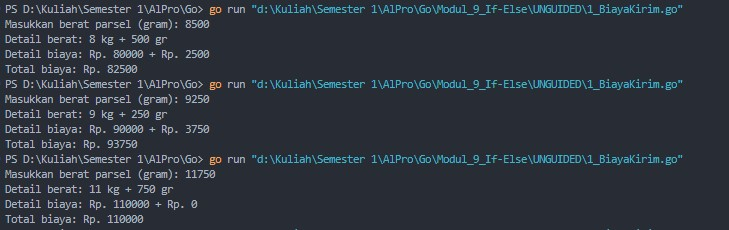

<div style="text-align: justify;">Program ini diawali dengan meminta **input berat parsel dalam gram** dari user. Setelah itu, program **menghitung total berat dalam kilogram** dengan membagi berat parsel dengan 1000, serta **menghitung sisa berat dalam gram** dengan operasi modulus (%). Kemudian, program menghitung **biaya pengiriman dasar** dengan mengalikan total berat dalam kg dengan **Rp. 10.000 per kg**. </div>

Selanjutnya, program menentukan **biaya tambahan** berdasarkan sisa berat. Jika total berat **lebih dari 10 kg**, maka sisa berat **tidak dikenakan biaya**. Jika sisa berat **≥ 500 gram**, maka dikenakan biaya tambahan **Rp. 5 per gram**, sedangkan jika **< 500 gram**, biaya tambahannya **Rp. 15 per gram**. Setelah semua perhitungan selesai, program menjumlahkan **biaya dasar dan biaya tambahan**, lalu menampilkan detail berat dan total biaya pengiriman kepada user.


### Soal 11

<div style="text-align: justify;">Diberikan sebuah nilai akhir mata kuliah (NAM) [0..100] dan standar penilaian nilai mata kuliah (NMK). Jawablah pertanyaan-pertanyaan berikut: a. Jika nam diberikan adalah 80.1, apa keluaran dari program tersebut? Apakah eksekusi program tersebut sesuai spesifikasi soal? b. Apa saja kesalahan dari program tersebut? Mengapa demikian? Jelaskan alur program seharusnya! c. Perbaiki program tersebut! Ujilah dengan masukan: 93.5; 70.6; dan 49.5. Seharusnya keluaran yang diperoleh adalah ‘A’, ‘B’, dan ‘D’.,</div>

```go
// a. Jika nam diberikan adalah 80.1,keluaran dari program tersebut adalah error dikarenakan terdapat kesalahan dalam tipe data. Program tersebut menyimpan string ("A", "AB", dll.) ke dalam variabel nam yang seharusnya bertipe float64. Akibatnya. kondisi perbandingan tidak sesuai dan tidak berfungsi.

// b. Kesalahan dari program tersebut: 1. Tipe data salah: Variabel nam diubah menjadi string untuk menyimpan nilai huruf (A, AB, dll), seharusnya tetap bertipe float64 untuk perhitungan. 2.Logika kondisi tidak tepat: Seharusnya kondisi if-else diperiksa secara berurutan dari nilai tertinggi hingga terendah 3. Penggunaan variabel nmk tidak sesuai: Program menyalahgunakan variabel nam untuk menyimpan nilai huruf, padahal nmk seharusnya yang menyimpan hasil penilaian. Alur yang benar adalah: 1. Menerima input nam (nilai akhir mata kuliah). 2. Berdasarkan rentang nilai nam, tentukan nilai huruf nmk. 3. Cetak nilai nmk sesuai dengan ketentuan.4

// c. Program diperbaiki dengan cara: 1. Menjaga tipe data nam tetap float64 untuk menerima input numerik 2. Menggunakan variabel nmk untuk menyimpan nilai huruf 3. Menggunakan struktur if-else untuk memeriksa rentang nilai dari yang terbesar hingga terkecil. Berikut adalah perbaikannya:

package main
  
import "fmt"
  
func main() {
    var nam float64
    var nmk string

    fmt.Print("Nilai akhir mata kuliah: ")
    fmt.Scan(&nam)

    if nam > 80 {
        nmk = "A"
    } else if nam > 72.5 {
        nmk = "AB"
    } else if nam > 65 {
        nmk = "B"
    } else if nam > 57.5 {
        nmk = "BC"
    } else if nam > 50 {
        nmk = "C"
    } else if nam > 40 {
        nmk = "D"
    } else {
        nmk = "E"
    }
   
    fmt.Println("Nilai mata kuliah: ", nmk)
}
```

> Output
> 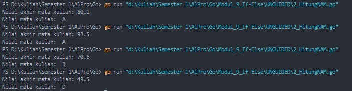

<div style="text-align: justify;">
a. Jika nam diberikan adalah 80.1,keluaran dari program tersebut adalah error dikarenakan terdapat kesalahan dalam tipe data. Program tersebut menyimpan string ("A", "AB", dll.) ke dalam variabel nam yang seharusnya bertipe float64. Akibatnya. kondisi perbandingan tidak sesuai dan tidak berfungsi.
</div>

<div style="text-align: justify;">
b. Kesalahan dari program tersebut: 1. Tipe data salah: Variabel nam diubah menjadi string untuk menyimpan nilai huruf (A, AB, dll), seharusnya tetap bertipe float64 untuk perhitungan. 2.Logika kondisi tidak tepat: Seharusnya kondisi if-else diperiksa secara berurutan dari nilai tertinggi hingga terendah 3. Penggunaan variabel nmk tidak sesuai: Program menyalahgunakan variabel nam untuk menyimpan nilai huruf, padahal nmk seharusnya yang menyimpan hasil penilaian. Alur yang benar adalah: 1. Menerima input nam (nilai akhir mata kuliah). 2. Berdasarkan rentang nilai nam, tentukan nilai huruf nmk. 3. Cetak nilai nmk sesuai dengan ketentuan.
</div>

<div style="text-align: justify;">
c. Program diperbaiki dengan cara: 1. Menjaga tipe data nam tetap float64 untuk menerima input numerik 2. Menggunakan variabel nmk untuk menyimpan nilai huruf 3. Menggunakan struktur if-else untuk memeriksa rentang nilai dari yang terbesar hingga terkecil.
</div>


### Soal 12

<div style="text-align: justify;">Sebuah bilangan bulat b memiliki faktor bilangan f > 0 jika f habis membagi b. Contoh: 2 merupakan faktor dari bilangan 6 karena 6 habis dibagi 2. Buatlah program yang menerima input sebuah bilangan bulat b dan b > 1. Program harus dapat mencari dan menampilkan semua faktor dari bilangan tersebut! Bilangan bulat b > 0 merupakan bilangan prima p jika dan hanya jika memiliki persis dua faktor bilangan saja, yaitu 1 dan dirinya sendiri. Lanjutkan program sebelumnya. Setelah menerima masukan sebuah bilangan bulat b > 0. Program tersebut mencari dan menampilkan semua faktor bilangan tersebut. Kemudian, program menentukan apakah b merupakan bilangan prima. </div>

```go
package main

import "fmt"
  
func main() {
    var b int
    var hitungFaktor int

    // Menerima input bilangan b
    fmt.Print("Bilangan: ")
    fmt.Scan(&b)

    // Menampilkan faktor-faktor dan menghitung jumlah faktor
    fmt.Print("Faktor: ")

    for i := 1; i <= b; i++ {
        if b%i == 0 {
            fmt.Print(i, " ")
            hitungFaktor++
        }
    }
    fmt.Println()

    // Menentukan apakah b adalah bilangan prima berdasarkan jumlah faktor
    if hitungFaktor == 2 {
        fmt.Println("Prima: true")
    } else {
        fmt.Println("Prima: false")
    }
}
```

> Output
> 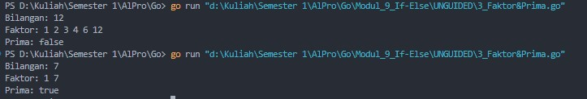

<div style="text-align: justify;">Program ini dimulai dengan meminta **input sebuah bilangan bulat** dari user. Setelah itu, program akan **mencari semua faktor** dari bilangan tersebut dengan melakukan perulangan dari **1 hingga bilangan itu sendiri**. Jika bilangan tersebut **habis dibagi oleh suatu angka**, maka angka tersebut dianggap sebagai faktor dan akan ditampilkan. Selain itu, program juga **menghitung jumlah faktor** yang ditemukan.
</div>

<div style="text-align: justify;">

Setelah semua faktor ditampilkan, program kemudian **menentukan apakah bilangan tersebut adalah bilangan prima**. Bilangan dikatakan **prima jika hanya memiliki dua faktor**, yaitu **1 dan dirinya sendiri**. Jika jumlah faktor yang ditemukan **sama dengan 2**, program mencetak **"Prima: true"**, jika lebih dari itu, program mencetak **"Prima: false"**.</div>
