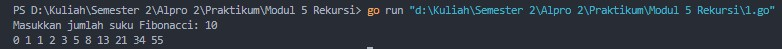
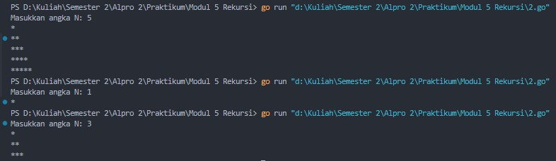
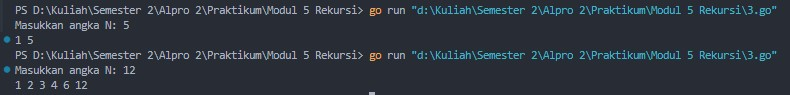
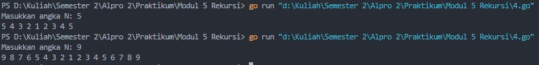
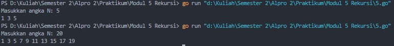
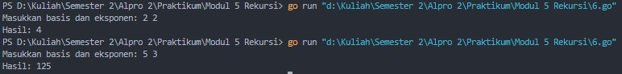

# <h1 align="center">Laporan Praktikum Modul 5 <br> Rekursif</h1>
<p align="center">Cholid Afiddrus Wijayanto - 103112430012</p>

## Dasar Teori

Rekursif adalah teknik dalam pemrograman di mana sebuah fungsi memanggil dirinya sendiri hingga mencapai base case, yaitu kondisi yang menghentikan rekursif agar tidak berjalan tanpa henti. Selain itu, terdapat recursive case, yaitu bagian di mana fungsi terus memanggil dirinya sendiri dengan parameter yang lebih kecil hingga mencapai base case. Rekursif digunakan untuk menyederhanakan masalah yang dapat dipecah menjadi submasalah yang lebih kecil, seperti pencarian, pengurutan, dan perhitungan matematis. Meskipun membuat kode lebih modular, penggunaan rekursif harus diperhatikan agar tidak menyebabkan stack overflow akibat pemanggilan berlebihan.

## Unguided

### Soal 1

Deret fibonacci adalah sebuah deret dengan nilai suku ke-0 dan ke-1 adalah 0 dan 1, dan nilai suku ke-n selanjutnya adalah hasil penjumlahan dua suku sebelumnya. Secara umum dapat diformulasikan 𝑆𝑛 = 𝑆𝑛−1 + 𝑆𝑛−2 . Berikut ini adalah contoh nilai deret fibonacci hingga suku ke-10. Buatlah program yang mengimplementasikan fungsi rekursif pada deret fibonacci tersebut.

```go
package main

import "fmt"

func fibonacci(n int) int {
    if n == 0 {
        return 0
    } else if n == 1 {
        return 1
    } else {
        return fibonacci(n-1) + fibonacci(n-2)
    }
}

  
func main() {
    var n int
    fmt.Print("Masukkan jumlah suku Fibonacci: ")
    fmt.Scan(&n)
    
    for i := 0; i <= n; i++ {
        fmt.Print(fibonacci(i), " ")

    }
}
```

**Output:**




Program di atas merupakan program yang digunakan untuk menampilkan deret Fibonacci hingga jumlah suku yang diinputkan oleh user (n). User diminta memasukkan sebuah bilangan bulat yang menunjukkan banyaknya suku Fibonacci yang ingin ditampilkan. Setelah menerima input, program menggunakan perulangan `for` untuk menghitung dan mencetak setiap bilangan Fibonacci dari **0 hingga n**.

Perhitungan deret Fibonacci dilakukan dengan fungsi rekursif `fibonacci(n)`, yang menentukan nilai Fibonacci berdasarkan aturan berikut: Jika **n = 0**, maka hasilnya adalah **0**, jika **n = 1**, maka hasilnya adalah **1**, sedangkan jika **n > 1**, hasilnya adalah jumlah dari dua bilangan Fibonacci sebelumnya, yaitu `fibonacci(n-1) + fibonacci(n-2)`. Proses ini dilakukan secara rekursif hingga mencapai nilai dasar, yaitu **n = 0** atau **n = 1**, yang kemudian digunakan untuk menghitung nilai Fibonacci pada tingkat yang lebih tinggi.

Dalam fungsi `main()`, setelah user memasukkan nilai **n**, program menjalankan perulangan `for` untuk memanggil fungsi `fibonacci(i)` dari **i = 0** hingga **i = n**, lalu mencetak setiap hasilnya dalam satu baris. Setiap pemanggilan fungsi `fibonacci` akan memecah masalah menjadi sub-masalah yang lebih kecil hingga mencapai kondisi dasar, sehingga memungkinkan perhitungan nilai Fibonacci dengan cara yang sistematis.

Kesimpulannya, program ini digunakan untuk menampilkan deret Fibonacci dengan memanfaatkan rekursi dalam fungsi `fibonacci` dan perulangan dalam fungsi `main()`, sehingga membentuk sebuah komposisi program yang efisien dalam menampilkan hasil perhitungan Fibonacci secara berurutan.
### Soal 2

Buatlah sebuah program yang digunakan untuk menampilkan pola bintang berikut ini dengan menggunakan fungsi rekursif. N adalah masukan dari user.

```go
package main

import "fmt"

func printBintang(n, i int) {
    if i > n {
        return
    }
    
    for j := 0; j < i; j++ {
        fmt.Print("*")
    }
    fmt.Println()
    printBintang(n, i+1)
}

func main() {
    var n int
    fmt.Print("Masukkan angka N: ")
    fmt.Scan(&n)
    printBintang(n, 1)
}
```

**Output:**



Program di atas merupakan program yang digunakan untuk menampilkan pola segitiga bintang berdasarkan angka **N** yang diinputkan oleh user. User diminta memasukkan sebuah bilangan bulat **N**, yang menentukan tinggi segitiga bintang yang akan ditampilkan. Setelah menerima input, program memanggil fungsi rekursif `printBintang(n, i)`, di mana **n** adalah batas tinggi segitiga dan **i** adalah jumlah bintang yang akan dicetak pada setiap baris.

Fungsi `printBintang` bekerja dengan mencetak bintang sebanyak **i** dalam satu baris menggunakan perulangan `for`, kemudian berpindah ke baris berikutnya dan memanggil dirinya sendiri dengan nilai **i** yang bertambah **1**. Proses ini terus berulang hingga nilai **i** melebihi **n**, yang menjadi kondisi penghentian rekursi. Pada setiap pemanggilan rekursif, jumlah bintang yang ditampilkan bertambah satu, sehingga membentuk pola segitiga.

Dalam fungsi `main()`, setelah user memasukkan nilai **N**, program langsung memanggil `printBintang(n, 1)`, yang memulai pencetakan bintang dari satu bintang di baris pertama hingga mencapai **N** bintang di baris terakhir. Setiap kali fungsi dipanggil secara rekursif, jumlah bintang bertambah, hingga akhirnya rekursi berhenti saat **i > n**.

Kesimpulannya, program ini digunakan untuk menampilkan pola segitiga bintang dengan memanfaatkan rekursi dalam fungsi `printBintang`, di mana setiap pemanggilan rekursif mencetak satu baris bintang dengan jumlah yang meningkat secara bertahap hingga mencapai nilai **N**.

### Soal 3

Buatlah program yang mengimplementasikan rekursif untuk menampilkan faktor bilangan dari suatu N, atau bilangan yang apa saja yang habis membagi N. Masukan terdiri dari sebuah bilangan bulat positif N. Keluaran terdiri dari barisan bilangan yang menjadi faktor dari N (terurut dari 1 hingga N ya).

```go
package main

import "fmt"

func faktor(n, i int) {
    if i > n {
        return
    }
    if n%i == 0 {
        fmt.Print(i, " ")
    }
    faktor(n, i+1)
}

func main() {
    var n int
    fmt.Print("Masukkan angka N: ")
    fmt.Scan(&n)
    faktor(n, 1)
}

```

**Output:**



Program di atas merupakan program yang digunakan untuk menampilkan semua faktor dari sebuah bilangan yang diinputkan oleh user (**N**). User diminta memasukkan sebuah bilangan bulat **N**, kemudian program akan mencari dan mencetak semua faktor dari **N** menggunakan fungsi rekursif `faktor(n, i)`.

Fungsi `faktor(n, i)` bekerja dengan mengecek apakah **i** merupakan faktor dari **N**. Jika **N** dapat dibagi habis oleh **i** (`n % i == 0`), maka **i** dicetak sebagai salah satu faktor. Setelah itu, fungsi memanggil dirinya sendiri dengan **i** yang bertambah **1**, sehingga proses ini terus berlanjut hingga nilai **i** melebihi **N**, yang menjadi kondisi penghentian rekursi.

Dalam fungsi `main()`, setelah user memasukkan nilai **N**, program langsung memanggil `faktor(n, 1)`, yang memulai pencarian faktor dari angka **1** hingga **N**. Pada setiap pemanggilan rekursif, nilai **i** bertambah **1** dan dicek apakah merupakan faktor dari **N**. Jika iya, angka tersebut dicetak.

Kesimpulannya, program ini digunakan untuk menampilkan semua faktor dari sebuah bilangan dengan memanfaatkan rekursi dalam fungsi `faktor`, di mana setiap pemanggilan rekursif akan memeriksa satu per satu angka dari **1 hingga N** untuk menentukan apakah angka tersebut merupakan faktor dari **N**.

### Soal 4

Buatlah program yang mengimplementasikan rekursif untuk menampilkan barisan bilangan tertentu. Masukan terdiri dari sebuah bilangan bulat positif N. Keluaran terdiri dari barisan bilangan dari N hingga 1 dan kembali ke N.

```go
package main

import "fmt"

func turunNaik(n, i int) {
    fmt.Print(i, " ")
    if i == 1 {
        return
    }
    turunNaik(n, i-1)
    fmt.Print(i, " ")
}

func main() {
    var n int
    fmt.Print("Masukkan angka N: ")
    fmt.Scan(&n)
    turunNaik(n, n)
}

```

**Output:**



Program di atas merupakan program yang digunakan untuk mencetak pola angka menurun dari **N** ke **1**, lalu naik kembali ke **N** menggunakan rekursi. User diminta memasukkan sebuah bilangan bulat **N**, yang menentukan batas tertinggi angka yang akan ditampilkan. Program kemudian memanggil fungsi rekursif `turunNaik(n, i)`, di mana **i** adalah angka yang sedang diproses.

Fungsi `turunNaik(n, i)` pertama-tama mencetak nilai **i**, kemudian memeriksa apakah **i** sudah mencapai **1**. Jika iya, maka rekursi dihentikan (`return`). Jika belum, fungsi memanggil dirinya sendiri dengan **i - 1**, sehingga angka terus menurun hingga mencapai **1**. Setelah mencapai **1**, fungsi melanjutkan eksekusi dari pemanggilan sebelumnya dan mencetak angka **i** lagi, sehingga menghasilkan pola angka yang turun dan naik kembali.

Dalam fungsi `main()`, setelah user memasukkan nilai **N**, program memanggil `turunNaik(n, n)`, yang memulai pencetakan dari **N**, menurunkan angka satu per satu hingga **1**, lalu menaikkannya kembali ke **N** setelah rekursi selesai.

Kesimpulannya, program ini digunakan untuk mencetak pola angka yang menurun dari **N** ke **1**, lalu naik kembali ke **N**, dengan memanfaatkan rekursi dalam fungsi `turunNaik`. Rekursi ini pertama menurunkan angka hingga mencapai **1**, kemudian secara otomatis naik kembali mengikuti urutan pemanggilan fungsi yang sebelumnya tertunda.

### Soal 5

Buatlah program yang mengimplementasikan rekursif untuk menampilkan barisan bilangan ganjil. Masukan terdiri dari sebuah bilangan bulat positif N. Keluaran terdiri dari barisan bilangan ganjil dari 1 hingga N.

```go
package main

import "fmt"

func ganjil(n, i int) {
    if i > n {
        return
    }
    fmt.Print(i, " ")
    ganjil(n, i+2)
}

func main() {
    var n int
    fmt.Print("Masukkan angka N: ")
    fmt.Scan(&n)
    ganjil(n, 1)
}

```

**Output:**



Program di atas merupakan program yang digunakan untuk mencetak bilangan ganjil dari **1** hingga **N** menggunakan rekursi. User diminta memasukkan sebuah bilangan bulat **N**, yang menentukan batas akhir dari bilangan ganjil yang akan ditampilkan. Program kemudian memanggil fungsi rekursif `ganjil(n, i)`, di mana **i** adalah angka ganjil yang sedang diproses.

Fungsi `ganjil(n, i)` pertama-tama memeriksa apakah **i** lebih besar dari **N**. Jika iya, maka rekursi dihentikan (`return`). Jika tidak, maka nilai **i** dicetak, kemudian fungsi memanggil dirinya sendiri dengan **i + 2**, sehingga angka yang diproses selalu bertambah **2** di setiap pemanggilan rekursif.

Dalam fungsi `main()`, setelah user memasukkan nilai **N**, program memanggil `ganjil(n, 1)`, yang memulai pencetakan dari angka **1** sebagai bilangan ganjil pertama, lalu meneruskan pencetakan ke angka ganjil berikutnya dengan menambahkan **2** setiap kali fungsi dipanggil kembali. Proses ini berlanjut hingga nilai **i** melebihi **N**, yang menjadi kondisi penghentian rekursi.

Kesimpulannya, program ini digunakan untuk menampilkan bilangan ganjil dari **1** hingga **N** dengan memanfaatkan rekursi dalam fungsi `ganjil`. Rekursi bekerja dengan mencetak angka ganjil saat ini, lalu memanggil dirinya sendiri dengan angka berikutnya yang lebih besar **2**, sehingga hanya bilangan ganjil yang akan ditampilkan dalam output.

### Soal 6

Buatlah program yang mengimplementasikan rekursif untuk mencari hasil pangkat dari dua buah bilangan. Masukan terdiri dari bilangan bulat x dan y. Keluaran terdiri dari hasil x dipangkatkan y. Catatan: diperbolehkan menggunakan asterik "*", tapi dilarang menggunakan import "math".

```go
package main

import "fmt"

func pangkat(x, y int) int {
    if y == 0 {
        return 1
    }
    return x * pangkat(x, y-1)
}

func main() {
    var x, y int
    fmt.Print("Masukkan basis dan eksponen: ")
    fmt.Scan(&x, &y)
    fmt.Println("Hasil:", pangkat(x, y))
}

```

**Output:**



Program di atas merupakan program yang digunakan untuk menghitung hasil perpangkatan suatu bilangan dengan eksponen tertentu menggunakan rekursi. User diminta memasukkan dua bilangan bulat, yaitu **x** sebagai basis dan **y** sebagai eksponen. Program kemudian memanggil fungsi rekursif `pangkat(x, y)`, yang bertugas menghitung **x^y** (x pangkat y).

Fungsi `pangkat(x, y)` bekerja dengan memeriksa apakah **y** sama dengan **0**. Jika iya, maka fungsi mengembalikan **1**, karena setiap bilangan yang dipangkatkan **0** hasilnya selalu **1**. Jika tidak, maka fungsi akan mengembalikan hasil perkalian **x** dengan hasil rekursif dari `pangkat(x, y-1)`, yaitu **x** dikalikan dengan **x** pangkat **(y-1)**. Dengan cara ini, rekursi terus berjalan hingga **y** mencapai **0**, di mana proses perkalian akan mulai dihitung mundur.

Dalam fungsi `main()`, setelah user memasukkan nilai **x** dan **y**, program memanggil `pangkat(x, y)`, yang secara rekursif menghitung hasil pangkat tersebut. Setelah selesai, hasilnya ditampilkan menggunakan `fmt.Println()`.

Kesimpulannya, program ini digunakan untuk menghitung perpangkatan dengan metode rekursi, di mana setiap pangkat dihitung berdasarkan hasil pangkat sebelumnya hingga mencapai kondisi dasar (**y == 0**). Dengan pendekatan ini, program dapat menghitung hasil pangkat tanpa menggunakan perulangan eksplisit.