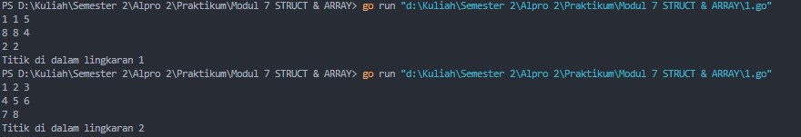
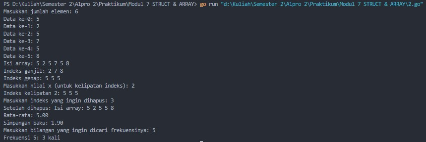
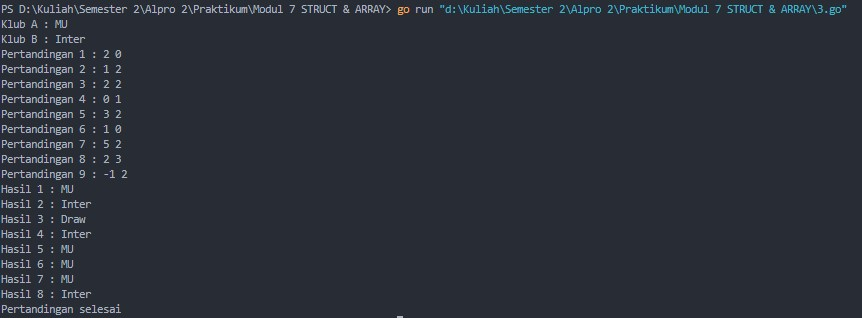
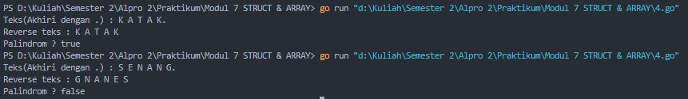

# <h1 align="center">Laporan Praktikum Modul 7 <br> STRUCT & ARRAY</h1>
<p align="center">Cholid Afiddrus Wijayanto - 103112430012</p>

## Dasar Teori

Tipe bentukan adalah tipe data yang kita buat sendiri dari tipe-tipe dasar agar sesuai dengan kebutuhan program. Alias (type) adalah cara memberi nama baru untuk tipe data supaya lebih mudah dipahami. Struct (atau record) digunakan untuk menggabungkan beberapa data berbeda, seperti nama, umur, dan alamat, menjadi satu. Array adalah tempat menyimpan banyak data dengan jenis yang sama dan jumlah tetap. Slice mirip dengan array, Tetapi lebih fleksibel karena jumlah datanya bisa berubah. Map digunakan untuk menyimpan data dengan pasangan kunci dan nilai, contohnya menyimpan nama sebagai kunci dan nomor telepon sebagai nilainya.

## Unguided

### Soal 1

Suatu lingkaran didefinisikan dengan koordinat titik pusat (𝑐𝑥, 𝑐𝑦) dengan radius 𝑟. Apabila diberikan dua buah lingkaran, maka tentukan posisi sebuah titik sembarang (𝑥, 𝑦) berdasarkan dua lingkaran tersebut. Gunakan tipe bentukan titik untuk menyimpan koordinat, dan tipe bentukan lingkaran untuk menyimpan titik pusat lingkaran dan radiusnya.
Masukan terdiri dari beberapa tiga baris. Baris pertama dan kedua adalah koordinat titik pusat dan radius dari lingkaran 1 dan lingkaran 2, sedangkan baris ketiga adalah koordinat titik sembarang. Asumsi sumbu x dan y dari semua titik dan juga radius direpresentasikan dengan bilangan bulat. Keluaran berupa string yang menyatakan posisi titik "Titik di dalam lingkaran 1 dan 2", "Titik di dalam lingkaran 1", "Titik di dalam lingkaran 2", atau "Titik di luar lingkaran 1 dan 2".

```go
package main

import (
    "fmt"
    "math"
)

type Titik struct {
    x, y int
}

type Lingkaran struct {
    pusat  Titik
    radius int
}

func jarak(p, q Titik) float64 {
    return math.Sqrt(float64((p.x-q.x)*(p.x-q.x) + (p.y-q.y)*(p.y-q.y)))
}

func didalam(c Lingkaran, p Titik) bool {
    return jarak(c.pusat, p) <= float64(c.radius)
}
  
func main() {
    var c1, c2 Lingkaran
    var p Titik

    fmt.Scan(&c1.pusat.x, &c1.pusat.y, &c1.radius)
    fmt.Scan(&c2.pusat.x, &c2.pusat.y, &c2.radius)
    fmt.Scan(&p.x, &p.y)

    insideC1 := didalam(c1, p)
    insideC2 := didalam(c2, p)
  
    if insideC1 && insideC2 {
        fmt.Println("Titik di dalam lingkaran 1 dan 2")
    } else if insideC1 {
        fmt.Println("Titik di dalam lingkaran 1")
    } else if insideC2 {
        fmt.Println("Titik di dalam lingkaran 2")
    } else {
        fmt.Println("Titik di luar lingkaran 1 dan 2")
    }
}
```

**Output:**


.jpg)

Program di atas merupakan program yang digunakan untuk menentukan posisi sebuah titik sembarang terhadap dua buah lingkaran. User diminta memasukkan tiga baris input, yaitu koordinat titik pusat dan radius dari lingkaran pertama, lingkaran kedua, serta koordinat dari titik sembarang. Untuk mempermudah pengolahan data, program menggunakan tipe bentukan struct, yaitu Titik untuk menyimpan koordinat (x, y) dan Lingkaran untuk menyimpan titik pusat bertipe Titik dan nilai radiusnya.

Program menggunakan fungsi jarak untuk menghitung jarak Euclidean antara dua titik berdasarkan rumus akar kuadrat dari penjumlahan kuadrat selisih masing-masing koordinat. Kemudian, fungsi didalam digunakan untuk menentukan apakah titik sembarang tersebut berada di dalam sebuah lingkaran, yaitu dengan memeriksa apakah hasil jarak titik terhadap pusat lingkaran lebih kecil atau sama dengan radius lingkaran. Selanjutnya, hasil pengecekan terhadap dua lingkaran tersebut digunakan dalam percabangan if-else untuk menentukan dan menampilkan posisi titik terhadap lingkaran pertama, kedua, keduanya, atau di luar keduanya.
### Soal 2

Sebuah array digunakan untuk menampung sekumpulan bilangan bulat. Buatlah program yang digunakan untuk mengisi array tersebut sebanyak N elemen nilai. Asumsikan array memiliki kapasitas penyimpanan data sejumlah elemen tertentu. Program dapat menampilkan beberapa informasi berikut: 
a. Menampilkan keseluruhan isi dari array. 
b. Menampilkan elemen-elemen array dengan indeks ganjil saja. 
c. Menampilkan elemen-elemen array dengan indeks genap saja (asumsi indek ke-0 adalah genap). 
d. Menampilkan elemen-elemen array dengan indeks kelipatan bilangan x. x bisa diperoleh dari masukan pengguna. 
e. Menghapus elemen array pada indeks tertentu, asumsi indeks yang hapus selalu valid. Tampilkan keseluruhan isi dari arraynya, pastikan data yang dihapus tidak tampil 
f. Menampilkan rata-rata dari bilangan yang ada di dalam array. 
g. Menampilkan standar deviasi atau simpangan baku dari bilangan yang ada di dalam array tersebut. 
h. Menampilkan frekuensi dari suatu bilangan tertentu di dalam array yang telah diisi tersebut

```go
package main

import (
    "fmt"
    "math"
)

const NMAX int = 100

func inputArray(arr *[NMAX]int, n *int) {
    fmt.Print("Masukkan jumlah elemen: ")
    fmt.Scan(&*n)

    for i := 0; i < *n; i++ {
        fmt.Printf("Data ke-%d: ", i)
        fmt.Scan(&arr[i])
    }
}

func tampilArray(arr [NMAX]int, n int) {
    fmt.Print("Isi array: ")
    for i := 0; i < n; i++ {
        fmt.Printf("%d ", arr[i])
    }
    fmt.Println()
}

func tampilIndeksGanjil(arr [NMAX]int, n int) {
    fmt.Print("Indeks ganjil: ")
    for i := 1; i < n; i += 2 {
        fmt.Printf("%d ", arr[i])
    }
    fmt.Println()
}

func tampilIndeksGenap(arr [NMAX]int, n int) {
    fmt.Print("Indeks genap: ")
    for i := 0; i < n; i += 2 {
        fmt.Printf("%d ", arr[i])
    }
    fmt.Println()
}

func tampilKelipatanX(arr [NMAX]int, n int, x int) {
    fmt.Printf("Indeks kelipatan %d: ", x)
    for i := 0; i < n; i++ {
        if i%x == 0 {
            fmt.Printf("%d ", arr[i])
        }
    }
    fmt.Println()
}
  
func hapusIndeks(arr *[NMAX]int, n *int, index int) {
    for i := index; i < *n-1; i++ {
        arr[i] = arr[i+1]
    }
    *n--
}
  
func hitungRataRata(arr [NMAX]int, n int) float64 {
    var total int
    for i := 0; i < n; i++ {
        total += arr[i]
    }
    return float64(total) / float64(n)
}
  
func hitungStandarDeviasi(arr [NMAX]int, n int) float64 {
    rata := hitungRataRata(arr, n)
    var jumlahKuadrat float64

    for i := 0; i < n; i++ {
        selisih := float64(arr[i]) - rata
        jumlahKuadrat += selisih * selisih
    }
    
    varian := jumlahKuadrat / float64(n)
    return math.Sqrt(varian)
}

func hitungFrekuensi(arr [NMAX]int, n int, angka int) int {
    jumlah := 0
    for i := 0; i < n; i++ {
        if arr[i] == angka {
            jumlah++
        }
    }
    return jumlah
}

func main() {
    var arr [NMAX]int
    var n int
  
    inputArray(&arr, &n)
    tampilArray(arr, n)
    tampilIndeksGanjil(arr, n)
    tampilIndeksGenap(arr, n)

    var x int
    fmt.Print("Masukkan nilai x (untuk kelipatan indeks): ")
    fmt.Scan(&x)
    tampilKelipatanX(arr, n, x)

    var idxHapus int
    fmt.Print("Masukkan indeks yang ingin dihapus: ")
    fmt.Scan(&idxHapus)
    hapusIndeks(&arr, &n, idxHapus)
    fmt.Print("Setelah dihapus: ")
    tampilArray(arr, n)

    fmt.Printf("Rata-rata: %.2f\n", hitungRataRata(arr, n))  
    fmt.Printf("Simpangan baku: %.2f\n", hitungStandarDeviasi(arr, n))

    var cari int
    fmt.Print("Masukkan bilangan yang ingin dicari frekuensinya: ")
    fmt.Scan(&cari)
    
    fmt.Printf("Frekuensi %d: %d kali\n", cari, hitungFrekuensi(arr, n, cari))
}
```

**Output:**



Program di atas merupakan program yang digunakan untuk mengelola dan menampilkan informasi dari sekumpulan bilangan bulat yang disimpan dalam sebuah array. User diminta memasukkan jumlah elemen (N) dan nilai-nilai elemen tersebut. Selanjutnya, program menggunakan berbagai fungsi dan prosedur yang saling terhubung untuk menampilkan isi array secara keseluruhan, menampilkan elemen dengan indeks ganjil, indeks genap, maupun indeks kelipatan bilangan tertentu yang ditentukan oleh user.

Program juga memungkinkan penghapusan elemen pada indeks tertentu dan memastikan bahwa elemen yang dihapus tidak ditampilkan lagi. Selain itu, ada perhitungan rata-rata dan simpangan baku dari elemen-elemen dalam array, serta pencarian frekuensi kemunculan suatu bilangan. Program ini menggunakan konsep komposisi dan array.

### Soal 3

Sebuah program digunakan untuk menyimpan dan menampilkan nama-nama klub yang memenangkan pertandingan bola pada suatu grup pertandingan. Buatlah program yang digunakan untuk merekap skor pertandingan bola 2 buah klub bola yang berlaga. 
Pertama-tama program meminta masukan nama-nama klub yang bertanding, kemudian program meminta masukan skor hasil pertandingan kedua klub tersebut. Yang disimpan dalam array adalah nama-nama klub yang menang saja. 
Proses input skor berhenti ketika skor salah satu atau kedua klub tidak valid (negatif). Di akhir program, tampilkan daftar klub yang memenangkan pertandingan.

```go
package main

import "fmt"
  
const MAX_PERTANDINGAN = 100

func main() {
    var klubA, klubB string
    var skorA, skorB int
    var hasil [MAX_PERTANDINGAN]string
    var jumlahPertandingan int = 0

    fmt.Print("Klub A : ")
    fmt.Scan(&klubA)

    fmt.Print("Klub B : ")
    fmt.Scan(&klubB)

    for {
        jumlahPertandingan++
        fmt.Printf("Pertandingan %d : ", jumlahPertandingan)
        fmt.Scan(&skorA, &skorB)

        if skorA < 0 || skorB < 0 {
            jumlahPertandingan--
            break
        }

        if skorA > skorB {
            hasil[jumlahPertandingan-1] = klubA
        } else if skorB > skorA {
            hasil[jumlahPertandingan-1] = klubB
        } else {
            hasil[jumlahPertandingan-1] = "Draw"
        }
    }
   
    for i := 0; i < jumlahPertandingan; i++ {
        fmt.Printf("Hasil %d : %s\n", i+1, hasil[i])
    }
    fmt.Println("Pertandingan selesai")
}
```

**Output:**



Program di atas merupakan program yang digunakan untuk merekap hasil pertandingan dua klub sepak bola berdasarkan skor yang dimasukkan oleh user. User diminta memasukkan nama dari dua klub yang akan bertanding, kemudian program menggunakan perulangan for untuk meminta input skor pertandingan dari kedua klub secara berulang. Setiap skor yang valid akan diperiksa, dan nama klub pemenang atau kata "Draw" jika pertandingan berakhir seri akan disimpan dalam array bernama hasil. Penyimpanan ini dilakukan berdasarkan urutan pertandingan, sehingga hasil pertandingan tersusun secara rapi. Array hasil bertipe data string dan berukuran tetap, digunakan untuk menyimpan nama-nama klub yang memenangkan pertandingan. Jika salah satu atau kedua skor yang dimasukkan negatif, maka proses input dihentikan. Setelah semua data pertandingan terkumpul, program menampilkan hasil dari setiap pertandingan sesuai dengan isi array. Kesimpulannya, program ini digunakan untuk menampilkan klub yang memenangkan pertandingan dengan memanfaatkan perulangan dan array sebagai struktur data utama yang menyimpan hasil, serta komposisi.

### Soal 4

Sebuah array digunakan untuk menampung sekumpulan karakter, Anda diminta untuk membuat sebuah subprogram untuk melakukan membalikkan urutan isi array dan memeriksa apakah membentuk palindrom.

```go
package main

import "fmt"

const NMAX int = 127
  
type tabel [NMAX]rune

func isiArray(t *tabel, n *int) {
    var kar rune
    fmt.Print("Teks(Akhiri dengan .) : ")

    *n = 0
    for {
        fmt.Scanf("%c", &kar)
        
        if kar == '.' || *n >= NMAX {
            break
        }

        if kar != ' ' && kar != '\n' && kar != '\r' {
            (*t)[*n] = kar
            *n++
        }
    }
}

func cetakArray(t tabel, n int) {
    for i := 0; i < n; i++ {
        fmt.Printf("%c ", t[i])
    }
    fmt.Println()
}

func balikanArray(t *tabel, n int) {
    for i := 0; i < n/2; i++ {
        (*t)[i], (*t)[n-1-i] = (*t)[n-1-i], (*t)[i]
    }
}

func palindrom(t tabel, n int) bool {
    var temp tabel
    for i := 0; i < n; i++ {
        temp[i] = t[i]
    }
    
    balikanArray(&temp, n)
    
    for i := 0; i < n; i++ {
        if t[i] != temp[i] {
            return false
        }
    }
    return true
}

func main() {
    var tab tabel
    var m int
    var tabAsli tabel
    
    isiArray(&tab, &m)
    
    for i := 0; i < m; i++ {
        tabAsli[i] = tab[i]
    }
  
    balikanArray(&tab, m)

    fmt.Print("Reverse teks : ")
    cetakArray(tab, m)

    isPalindrom := palindrom(tabAsli, m)
    fmt.Printf("Palindrom ? %t\n", isPalindrom)
}
```

**Output:**



Program di atas merupakan program yang digunakan untuk membaca sekumpulan karakter yang dimasukkan oleh user dan mengecek apakah karakter-karakter tersebut membentuk sebuah palindrom. User diminta untuk memasukkan teks dan program akan berhenti jika user menginputkan simbol titik (.), kemudian karakter disimpan ke dalam array satu per satu selama jumlahnya belum melebihi batas maksimum (NMAX). Setelah itu, isi array dibalik menggunakan prosedur balikanArray, dan hasilnya ditampilkan kembali dengan memanfaatkan prosedur cetakArray.

Untuk mengecek apakah susunan karakter merupakan palindrom, program memanggil fungsi palindrom. Fungsi ini bekerja dengan membuat salinan dari array asli, lalu membalikkan isi salinan menggunakan prosedur balikanArray, dan membandingkan elemen per elemen dari array asli dan salinan. Jika seluruh elemen sama, maka dikembalikan nilai true yang menunjukkan bahwa karakter membentuk palindrom.
